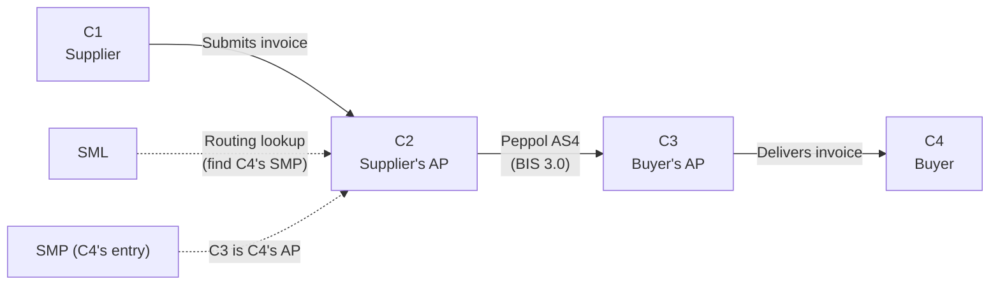
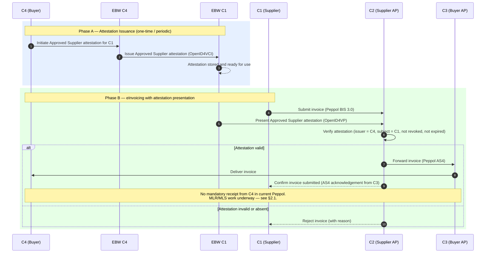
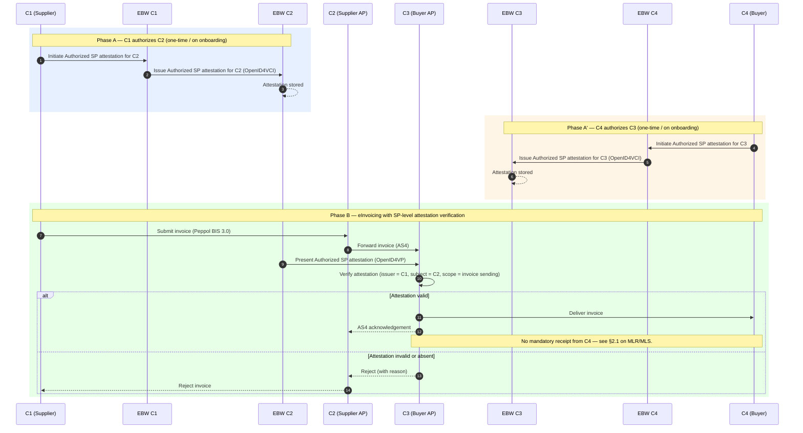
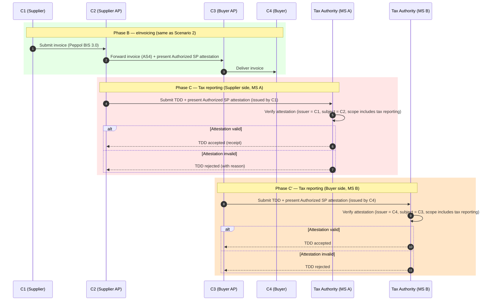
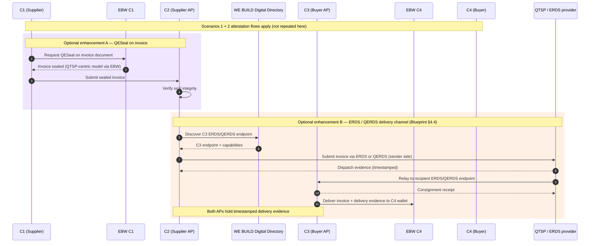

# SC5 — eInvoicing: Scenario Specification

**WE BUILD consortium | WP2 — UC SC5**

| | |
|---|---|
| **Date** | 2026-03-20 |
| **Version** | 0.3 (draft) |
| **Status** | Draft |
| **Author(s)** | Rune Kjørlaug - OpenPeppol |

---

## Index

1. [Introduction](#1-introduction)
   - 1.1 [Objectives of this document](#11-objectives-of-this-document)
   - 1.2 [Scenario overview](#12-scenario-overview)
   - 1.3 [Reference documents](#13-reference-documents)
2. [Common concepts and architecture](#2-common-concepts-and-architecture)
   - 2.1 [The Peppol 4-corner model](#21-the-peppol-4-corner-model)
   - 2.2 [Trust enhancement through attestations](#22-trust-enhancement-through-attestations)
   - 2.3 [Common pre-conditions](#23-common-pre-conditions)
3. [Scenario 1 — Supplier pre-approval](#3-scenario-1--supplier-pre-approval)
4. [Scenario 2 — Service Provider authorization](#4-scenario-2--service-provider-authorization)
5. [Scenario 3 — Service Provider authorization verifiable by Tax Administration](#5-scenario-3--service-provider-authorization-verifiable-by-tax-administration)
6. [Scenario 5 — Peppol enhancements](#6-scenario-5--peppol-enhancements)
7. [Roles and participants](#7-roles-and-participants)
8. [Attestations](#8-attestations)
- [Annex 1 — Requirements for scenario roles](#annex-1--requirements-for-scenario-roles)
- [Annex 2 — Abbreviations](#annex-2--abbreviations)

---

## 1. Introduction

### 1.1 Objectives of this document

This document describes the scenario specifications for Use Case SC5 (eInvoicing) in Work Package 2 of the WE BUILD consortium. It provides detailed information on the processes to be piloted, the attestations used, the actors involved, and the dependencies on other use cases and work packages.

This document covers Scenarios 1, 2, 3 and 5. Scenario 4 (Direct eInvoicing using Business Wallets) is specified separately.

The document is a product of the Specification Phase of the WE BUILD LSP and serves as a key input to solution development and pilot preparation. Scenarios 1 and 2 are part of the Minimum Viable Product (MVP). Scenarios 3 and 5 are designated MVP+.

### 1.2 Scenario overview

The SC5 scenarios share a common foundation: the Peppol network's 4-corner model for invoice exchange, enhanced with European Business Wallet (EBW) attestations to strengthen trust, prevent fraud, and enable machine-verifiable authorization. The table below provides an overview.

| ID | Scenario name | Attestation(s) | MVP |
|----|--------------|----------------|-----|
| 1 | Supplier pre-approval | Approved Supplier | Y |
| 2 | Service Provider authorization | Authorized Service Provider | Y |
| 3 | SP authorization verifiable by Tax Administration | Authorized Service Provider | N (MVP+) |
| 5 | Peppol enhancements | As per scenarios 1, 2, 3 | N (MVP+) |

### 1.3 Reference documents

**WE BUILD project documents**

- SC5 Stock Taking document v1.0 (11/12/2025)
- [WE BUILD Architecture & Integration Blueprint (D4.1)](https://webuild-consortium.github.io/wp4-architecture/blueprint/blueprint.html)
- [WE BUILD Architectural Decision Records (ADRs)](https://github.com/webuild-consortium/wp4-architecture/tree/main/adr) — in particular:
  - ADR: Provide EBWOID as a stable minimal basis
  - ADR: Attestation Revocation Mechanism
  - ADR: Specify PID and eAA formats
  - ADR: Baseline protocols
  - ADR: Deliver business wallet data using QERDS
- [WE BUILD Conformance Specification cs-01: Credential Issuance](https://github.com/webuild-consortium/wp4-architecture/blob/main/conformance-specs/cs-01-credential-issuance.md)
- [WE BUILD Conformance Specification cs-02: Credential Presentation](https://github.com/webuild-consortium/wp4-architecture/blob/main/conformance-specs/cs-02-credential-presentation.md)
- [WE BUILD Attestation Rulebooks catalog](https://github.com/webuild-consortium/webuild-attestation-rulebooks-catalog)

**Regulatory and standards**

- ARF (version to be confirmed)
- eIDAS Regulation (amended by 2024/1183) and relevant Implementing Acts
- EBW Regulation proposal
- Peppol BIS Billing 3.0
- Peppol AS4 Profile
- EN 16931 (European e-invoicing standard)
- EWC RB001 — LPID Rulebook (predecessor; EBWOID rulebook to be published under WE BUILD)
- EWC RB002 — EUCC Rulebook
- OpenID4VCI (latest version)
- OpenID4VP (latest version)
- SD-JWT-VC specification
- W3C Verifiable Credentials Data Model (VCDM)
- IETF Token Status List (revocation)

---

## 2. Common concepts and architecture

### 2.1 The Peppol 4-corner model

All Peppol-based scenarios (1, 2, 3 and 5) operate within the standard 4-corner model:

- **C1** — Sending end user (Supplier): creates and sends the invoice
- **C2** — Sending Service Provider (Access Point): transmits the invoice on behalf of C1
- **C3** — Receiving Service Provider (Access Point): receives the invoice on behalf of C4
- **C4** — Receiving end user (Buyer): receives and processes the invoice

Invoice exchange follows the Peppol BIS 3.0 format over AS4. C2 resolves the delivery endpoint for a given invoice by querying the SML to find C4's SMP, which returns C3 as the AP authorised to receive on C4's behalf. SC5 does not change the transport layer — it adds verifiable trust signals at key decision points in the flow.

> **Note on receipts (MLR/MLS):** The current Peppol specification does not mandate an application-level receipt from C4 back to C1 confirming that an invoice has been processed or accepted. The AS4 transport acknowledgement between C3 and C2 is the only standardised confirmation. Work is ongoing within the Peppol community on **Message Level Response (MLR)** and **Message Level Status (MLS)** to introduce a standardised business-level receipt mechanism. SC5 should monitor this work, as a future MLR/MLS could carry attestation-related metadata — for instance, confirming that C4 accepted the invoice against a valid Approved Supplier attestation — and would close a significant gap in the end-to-end trust chain.

### 2.2 Trust enhancement through attestations

The core idea of SC5 is that the invoice itself remains unchanged (Peppol BIS 3.0), while wallet-based attestations provide verifiable, machine-readable proof of authorization at specific steps. This is a non-intrusive enhancement: it does not require changes to the Peppol transport or message format.

Two new attestation types are introduced:

- **Approved Supplier attestation** — issued by a Buyer (C4) to a Supplier (C1), proving that C4 has an active commercial relationship with C1 and approves invoices from them.
- **Authorized Service Provider attestation** — issued by a company (C1 or C4) to its Service Provider (C2 or C3), proving that the SP is authorized to send or receive invoices on the company's behalf.

Both attestation types are Electronic Attestations of Attributes (EAA) in the sense of eIDAS 2.0. Whether they need to be Qualified (QEAA) is a working assumption pending further analysis (see section 3.7 and 4.7).

### 2.3 Common pre-conditions

The following pre-conditions apply across all Peppol-based SC5 scenarios:

1. C1 (Supplier) and C4 (Buyer) are registered Peppol participants with entries in the SMP. C4's SMP entry records C3 as the Access Point authorised to receive documents on C4's behalf; C1's SMP entry records C2 similarly. C2 and C3 do not have their own SMP entries — they are service providers acting on behalf of their clients.
2. C2 and C3 are certified Peppol Access Points.
3. European Business Wallets are available and operational for C1, C4, and the SPs as applicable; wallet providers have passed ITB testing.
4. EBWOID attestations are issued to the relevant business wallets by WP4-designated EBWOID providers.
5. WP4 trust infrastructure is operational: the WE BUILD LoTL, WE BUILD Trusted Lists, and relying party registration are available.
6. The Approved Supplier and Authorized Service Provider attestation schemas and rulebooks are defined (to be delivered by SC5 in coordination with the WP4 semantics group and published in the WE BUILD Attestation Rulebooks catalog).
7. Issuers, Holders and Verifiers implement the WE BUILD Conformance Specifications cs-01 (issuance) and cs-02 (presentation) for the above attestation types.
8. Revocation infrastructure for SC5 attestations is operational, using the IETF Token Status List mechanism as mandated by the WE BUILD ADR on Attestation Revocation.

### 2.4 WE BUILD pilot context and qualification model

SC5 operates within the WE BUILD pilot environment, which is a large-scale test environment and not the final eIDAS production ecosystem. This has specific implications for how trust and qualification are handled in the pilot, as documented in the Blueprint (D4.1, section 1.2.1).

| WE BUILD does **not** | WE BUILD **does** |
|----------------------|-------------------|
| Issue eIDAS-qualified attestations (QEAA) | Define WE BUILD QEAA focused on technical interoperability |
| Use the EC List of Trusted Lists (LoTL) | Provide a WE BUILD LoTL |
| Use MS Trusted Lists | Provide WE BUILD Trusted Lists with input from supervisory bodies where available |
| Issue eIDAS RP access certificates | Issue WE BUILD RP access certificates |
| Reach production-level legal liability | Operate within the WE BUILD agreement and trust framework |

Consequently, any reference in this document to "QEAA" in the pilot context means **WE BUILD QEAA**: a technically interoperable credential that follows eIDAS patterns and passes the Interoperability Testbed (ITB), but does not carry eIDAS legal qualification.

All SC5 implementations — wallet providers, issuers, verifiers — must pass the ITB before participating in pilots. The WBCS (cs-01 for issuance, cs-02 for presentation) define the technical requirements that implementations must conform to.

### 2.5 System-to-system wallet interactions

The Peppol-based SC5 scenarios involve machine-to-machine flows between backend systems (Access Points), not direct end-user interactions. As noted in the Blueprint (section 4.5), enterprise and system-to-system wallet interactions are fully supported: credential issuance and presentation may be initiated by backend systems, while the same trust framework, credential formats and verification mechanisms apply as in user-driven flows.

This is directly applicable to SC5: C2 acts as a Verifier in a fully automated pipeline when it checks attestations on incoming invoice submissions. The OpenID4VP exchange between C1's EBW and C2, or between C2 and C3, is a system-to-system interaction with no human-in-the-loop required at runtime. The working assumptions in each scenario section (WA1.3, WA2.2) are grounded in this architectural pattern.

### 3.1 Introduction

Scenario 1 introduces the **Approved Supplier attestation** as a mechanism for a Buyer (C4) to pre-approve a Supplier (C1) and make this approval verifiable at the Service Provider level (C2). When C1 submits an invoice, C2 can verify — before transmitting — that C1 holds a valid approval from C4. This prevents unauthorized or fraudulent invoices from entering the Peppol network on behalf of buyers who have not established a commercial relationship with the sending supplier.

This scenario establishes the foundational buyer-supplier trust relationship and is the primary MVP scenario.

### 3.2 Pre-conditions

In addition to the common pre-conditions (section 2.3):

1. C4 has an operational EBW capable of issuing the Approved Supplier attestation.
2. C1 has an EBW capable of receiving and presenting the Approved Supplier attestation.
3. C2 is a Verifier/Relying Party capable of verifying the Approved Supplier attestation via OpenID4VP.
4. The Approved Supplier attestation schema is available and accepted by all parties.
5. C4 has established a commercial relationship with C1 outside of the wallet system (e.g. via a procurement process) and is ready to attest to it.

### 3.3 Main flow

The flow consists of two phases: an **attestation issuance phase** (typically a one-time or periodic activity) and the **invoice submission phase** (recurring).

### 3.4 Detailed scenario flow

| Step | Actor | Description | Dependencies | Variations / exceptions |
|------|-------|-------------|--------------|------------------------|
| A.1 | C4 | C4 initiates the issuance of an Approved Supplier attestation for C1 through their EBW interface. The attestation identifies C1 (via EBWOID / EUID) as an approved supplier of C4. | EBWOID for C1 must be resolvable by C4 | C4 may issue the attestation for a limited validity period or with product/category scope |
| A.2 | EBW C4 → EBW C1 | The EBW of C4 (acting as Issuer) issues the attestation to the EBW of C1 using OpenID4VCI. The attestation is signed by C4 and bound to C1's wallet. | OpenID4VCI interoperability between wallets; Approved Supplier schema available | Batch issuance for multiple suppliers; delegation to procurement platform |
| A.3 | EBW C1 | C1's EBW stores the attestation. C1 is notified. | — | C1 may have multiple Approved Supplier attestations from different buyers |
| B.1 | C1 | C1 creates the invoice in Peppol BIS 3.0 format and initiates submission to C2. As part of the submission handshake, C1 presents the Approved Supplier attestation for the relevant buyer (C4) via OpenID4VP. | Approved Supplier attestation in EBW C1; C2 supports OpenID4VP verification | C1 may present the attestation out-of-band (API call separate from invoice submission); scope to be defined |
| B.2 | C2 | C2 acts as Verifier/Relying Party. It verifies: (a) the attestation signature (issuer = C4), (b) the subject matches C1, (c) the attestation is within its validity period, (d) the attestation has not been revoked. | Trust registry accessible to C2; revocation endpoint operational | C2 may cache verification results for a configurable period to avoid repeated checks |
| B.3a | C2 → C3 | If verification succeeds, C2 forwards the invoice to C3 via Peppol AS4. C2 resolves the recipient by looking up C4's Peppol ID in the SML/SMP, which returns C3 as the AP authorised to receive on C4's behalf. | C4 registered in SMP with C3 as receiving AP | C2 may attach attestation metadata to the AS4 message (optional, to be specified) |
| B.3b | C2 → C1 | If verification fails (invalid, absent, expired, revoked), C2 rejects the invoice and returns an error to C1 with a standardized reason code. | — | Reason codes: ATTESTATION_MISSING, ATTESTATION_INVALID, ATTESTATION_EXPIRED, ATTESTATION_REVOKED |
| B.4 | C3 → C4 | C3 delivers the invoice to C4 using the agreed delivery mechanism. | — | — |
| B.5 | C3 → C2 → C1 | C3 returns an AS4-level acknowledgement to C2; C2 confirms submission to C1. There is no mandatory application-level receipt from C4 back to C1 in the current Peppol specification. Work on Message Level Response (MLR) and Message Level Status (MLS) is ongoing within the Peppol community and may introduce a standardised receipt mechanism; SC5 should monitor this and consider it for Scenario 5. | — | If MLR/MLS becomes available, C4's receipt could carry attestation-related metadata confirming the invoice was accepted against a valid Approved Supplier attestation |

### 3.5 Additional flows

| Variation/exception | Description |
|--------------------|-------------|
| Attestation renewal | If the Approved Supplier attestation has expired, C1 must request renewal from C4 before submitting invoices. C2 rejects the invoice with reason ATTESTATION_EXPIRED. |
| Multi-buyer scenario | C1 may hold multiple Approved Supplier attestations (one per buyer). C2 selects the relevant one based on C4's Peppol ID present in the invoice. |
| Attestation revocation | C4 may revoke the attestation at any time (e.g. if the commercial relationship ends). C2 checks revocation status on each submission or on a cached basis. |

The following will NOT be piloted in Scenario 1: proximity-based presentation, natural person wallet flows, and changes to the Peppol message format itself.

### 3.6 Challenges and barriers

- **No existing Approved Supplier attestation schema**: a new EAA schema and rulebook must be designed from scratch, in coordination with WP4 (semantics group).
- **Wallet interoperability**: the Buyer's EBW and the Supplier's EBW may be from different providers; cross-wallet OpenID4VCI issuance must be tested.
- **C2 integration**: Peppol Access Points must be extended to act as OpenID4VP Verifiers; this requires changes to their onboarding and operational software.
- **Revocation infrastructure**: revocation of the Approved Supplier attestation must be implemented using the IETF Token Status List, as mandated by the WE BUILD ADR on Attestation Revocation. Attestations with a validity period ≤ 24 hours are exempt from revocation requirements; longer-lived attestations (expected for the Approved Supplier relationship) require a live Token Status List endpoint accessible to C2.
- **EBWOID availability**: issuance of EBWOIDs in all piloting Member States is required before Scenario 1 can be piloted cross-border.

### 3.7 Working assumptions

| # | Assumption | Rationale |
|---|-----------|-----------|
| WA1.1 | The Approved Supplier attestation is implemented as a non-qualified EAA (not QEAA) for the MVP pilot. | A QEAA mandate would require QTSP involvement and may not be feasible within pilot timelines. This can be escalated for production. |
| WA1.2 | C2 is the primary Verifier for the attestation; C3 does not verify in Scenario 1. | Placing verification at C2 prevents unauthorized invoices from entering the network at the source. Adding C3 verification is a Scenario 2 / Scenario 5 enhancement. |
| WA1.3 | The attestation is presented via a machine-to-machine OpenID4VP flow, not a browser-based user interaction. | The invoice submission process in Peppol is automated; human-in-the-loop wallet interactions are not appropriate for production invoice flows. |
| WA1.5 | In the WE BUILD pilot, "QEAA" means WE BUILD QEAA (technically interoperable, ITB-tested) rather than eIDAS-qualified. | The WE BUILD pilot environment does not operate within the formal eIDAS certification framework. Production escalation to eIDAS QEAA is a post-pilot decision. |

---

## 4. Scenario 2 — Service Provider authorization

### 4.1 Introduction

Scenario 2 introduces the **Authorized Service Provider attestation**, issued by a company (C1 or C4) to its Service Provider (C2 or C3 respectively). This allows the receiving AP (C3) to verify — before accepting an invoice — that the sending AP (C2) is legitimately authorized to act on behalf of the sending company (C1).

This adds an additional layer of trust between the APs, complementing Scenario 1's buyer-supplier trust. It guards against unauthorized or misconfigured APs transmitting invoices without a valid mandate from the company they claim to represent.

### 4.2 Pre-conditions

In addition to common pre-conditions (section 2.3):

1. C1 has an EBW capable of issuing the Authorized Service Provider attestation to C2.
2. C4 has an EBW capable of issuing the Authorized Service Provider attestation to C3 (required if C3-side verification is piloted).
3. C2 and C3 have EBWs (or equivalent wallet-capable infrastructure) to receive and present attestations.
4. C3 is a Verifier capable of verifying the Authorized Service Provider attestation presented by C2.
5. The Authorized Service Provider attestation schema is available and accepted by all parties.

### 4.3 Main flow

### 4.4 Detailed scenario flow

| Step | Actor | Description | Dependencies | Variations / exceptions |
|------|-------|-------------|--------------|------------------------|
| A.1 | C1 | C1 initiates the issuance of an Authorized SP attestation for C2 via C1's EBW. The attestation certifies that C2 is authorized to send invoices on behalf of C1. | EBWOID for C2 must be resolvable; Authorized SP schema available | Attestation may be scoped to specific document types or Peppol process IDs |
| A.2 | EBW C1 → EBW C2 | C1's EBW issues the attestation to C2's EBW via OpenID4VCI. | OpenID4VCI interoperability | — |
| A'.1 | C4 | C4 issues an Authorized SP attestation for C3 (mirror of A.1 on the receiving side). | — | This step is optional for the MVP; see WA2.1 |
| B.1 | C1 → C2 | C1 submits invoice to C2 through normal Peppol onboarding channel. | — | Optionally combined with Scenario 1 attestation presentation |
| B.2 | C2 → C3 | C2 sends the invoice to C3 via Peppol AS4. As part of the AS4 exchange (or a preceding handshake), C2 presents its Authorized SP attestation to C3 via OpenID4VP. | C3 supports OpenID4VP; trust registry accessible | Timing of attestation presentation (before AS4, during AS4 header, or as separate API call) to be specified |
| B.3 | C3 | C3 verifies: (a) attestation issuer = C1, (b) subject = C2, (c) validity period, (d) not revoked, (e) scope covers invoice transmission. | Trust registry; revocation endpoint | C3 may also verify C4 has authorized it (if A' was performed) |
| B.4a | C3 → C4 | If valid, C3 delivers to C4. | — | — |
| B.4b | C3 → C2 | If invalid, C3 rejects with reason code. C2 notifies C1. | — | — |

### 4.5 Additional flows

| Variation/exception | Description |
|--------------------|-------------|
| SP change | When C1 changes to a new AP, the old Authorized SP attestation must be revoked and a new one issued. |
| Mutual verification | C2 may request to verify C3's authorization (C4 → C3) before sending. This symmetric trust model may be mandated in Scenario 5. |

### 4.6 Challenges and barriers

- **Wallet for Service Providers**: APs need EBWs or equivalent infrastructure to hold and present attestations. This is a significant change to current AP software and operational practice.
- **AS4 integration point**: defining where exactly attestation presentation fits into the AS4 message exchange is a key technical design question requiring alignment with the Peppol AS4 profile owners.
- **Schema alignment with Scenario 1**: the Authorized SP attestation schema must be designed to complement the Approved Supplier attestation without creating redundancy.

### 4.7 Working assumptions

| # | Assumption | Rationale |
|---|-----------|-----------|
| WA2.1 | For the MVP, only the C2-to-C3 verification is piloted (C2 presents attestation from C1 to C3). C3's authorization by C4 is MVP+. | Reduces scope and partner complexity for the MVP. The asymmetric model still provides meaningful fraud prevention. |
| WA2.2 | Attestation presentation by C2 to C3 occurs as a pre-transmission handshake, not embedded in the AS4 message itself. | Avoids changes to the Peppol AS4 message format. The handshake can be an OpenID4VP exchange triggered before the AS4 SUBMIT call. |

---

## 5. Scenario 3 — Service Provider authorization verifiable by Tax Administration

### 5.1 Introduction

Scenario 3 extends the Authorized Service Provider attestation from Scenario 2 to the tax reporting context under **ViDA (VAT in the Digital Age)**. ViDA requires that structured invoice data be reported to tax authorities in (near) real time. In the Peppol network, this reporting will often be done by the AP (C2 or C3) on behalf of the company they represent, not by the company directly.

Scenario 3 ensures that a Tax Authority can verify that the SP submitting tax-related data on behalf of a company is genuinely authorized to do so, using the same Authorized Service Provider attestation defined in Scenario 2.

This scenario is designated MVP+.

### 5.2 Pre-conditions

In addition to Scenario 2 pre-conditions:

1. C2 holds an Authorized SP attestation from C1 (as in Scenario 2).
2. C3 holds an Authorized SP attestation from C4 (as in Scenario 2, A').
3. Tax Authorities in the piloting Member States are reachable via a defined API endpoint and are capable of verifying EBW attestations.
4. The Tax Data Document (TDD) format used in the pilot is aligned with the Peppol ViDA pilot outputs. SC5 will adopt the format and process definitions from that pilot rather than specifying them independently.
5. The Peppol ViDA pilot is sufficiently advanced to provide a reference TDD format and reporting process for SC5 to build on.

### 5.3 Main flow

The invoice exchange flow is identical to Scenario 2. The additional steps relate to tax reporting, triggered after invoice delivery.

### 5.4 Detailed scenario flow

| Step | Actor | Description | Dependencies | Variations / exceptions |
|------|-------|-------------|--------------|------------------------|
| B.1–B.4 | As Scenario 2 | Invoice exchange proceeds as in Scenario 2. | See Scenario 2 | — |
| C.1 | C2 | Following invoice transmission, C2 prepares a Tax Data Document (TDD) for submission to Tax Authority of MS A (C1's home country). C2 presents its Authorized SP attestation (issued by C1) alongside the TDD. | Authorized SP attestation includes tax reporting scope; TA API available | Timing: real-time alongside invoice, or near-real-time batch |
| C.2 | TA_A | Tax Authority verifies: (a) issuer = C1, (b) subject = C2, (c) attestation scope covers tax reporting, (d) validity and revocation status. | TA connected to trust registry | TA may request additional claims (e.g. VAT registration number) |
| C.3a | TA_A → C2 | If valid, TA accepts TDD and returns a signed receipt. | — | Receipt can serve as proof of reporting obligation fulfilled |
| C.3b | TA_A → C2 | If invalid, TA rejects TDD with reason. C2 must resolve (re-obtain attestation or escalate). | — | — |
| C'.1–C'.3 | C3, TA_B | Mirror of C.1–C.3 on the buyer side (MS B). C3 reports using its attestation from C4. | — | MS B may be the same as MS A in domestic invoicing scenarios |

### 5.5 Challenges and barriers

- **Alignment with the Peppol ViDA pilot**: Peppol is actively engaged in a dedicated ViDA pilot in which invoice formats, Tax Data Document structures, and reporting processes are being defined and tested. SC5 Scenario 3 must align with and reference the outputs of that pilot rather than developing parallel specifications. The Peppol ViDA pilot is the primary reference point for the TDD format, reporting triggers, and the interface between the Peppol network and tax authority endpoints used in this scenario.
- **Tax Authority readiness**: Tax Authorities in piloting Member States must build or adapt API endpoints capable of receiving and verifying EBW attestations. This is a significant dependency outside the consortium.
- **Scope attribute in attestation**: the Authorized SP attestation from Scenario 2 must include a scope attribute that explicitly covers tax reporting. This must be reflected in the schema.
- **Cross-border ViDA rules**: when C1 and C4 are in different Member States, the reporting rules may differ. The scenario must be designed to handle both same-country and cross-border invoice flows.

### 5.6 Working assumptions

| # | Assumption | Rationale |
|---|-----------|-----------|
| WA3.1 | The Authorized SP attestation used in Scenario 2 is the same attestation used in Scenario 3, with an added scope attribute for tax reporting. | Avoids creating a separate attestation type; scope attributes control which use cases the attestation covers. |
| WA3.2 | The TDD format and reporting process used in Scenario 3 follow the Peppol ViDA pilot definitions. SC5 does not independently specify these — it consumes them as an input. | Avoids duplication and ensures SC5 remains aligned with the broader Peppol ViDA effort; any deviation would risk incompatibility with the emerging European standard for ViDA reporting. |
| WA3.3 | Reporting is triggered per invoice (not batched) in the pilot for simplicity. | Batch reporting is an optimization for production; per-invoice reporting is simpler to trace and verify in a pilot context. |

---

## 6. Scenario 5 — Peppol enhancements

### 6.1 Introduction

Scenario 5 explores additional or alternative trust-building mechanisms that can be introduced into the standard Peppol flow, beyond the attestation-based approach of Scenarios 1–3. It is research-oriented (MVP+) and evaluates whether these mechanisms provide proportionate value relative to their complexity and cost.

A natural structural alignment exists between the Peppol 4-corner model and the QERDS delivery architecture defined in the WE BUILD Blueprint (section 4.4): sender QTSP (A) ↔ C2, recipient QTSP (B) ↔ C3, with the WE BUILD Digital Directory for endpoint discovery. Scenario 5 explores whether this pattern adds meaningful non-repudiation and legal certainty beyond what the existing Peppol PKI and AS4 transport already provide, and evaluates the proportionality of the Qualified (Q) level relative to the ERDS (non-qualified) alternative.

### 6.2 Pre-conditions

In addition to common pre-conditions (section 2.3):

1. At least one of Scenarios 1 or 2 is operational in the pilot.
2. A QTSP capable of providing QESeal and/or QERDS/ERDS services is available to at least one AP in the pilot.
3. The added mechanisms are not disruptive to the core Peppol flow.

### 6.3 Main flow

The following illustrates how the QERDS four-corner delivery model (Blueprint section 4.4) maps onto the Peppol 4-corner model, and how QESeal can be applied at the C1 level. The exact combination to be piloted is TBD.

### 6.4 Sub-scenarios under investigation

| Enhancement | Description | Value | Complexity |
|------------|-------------|-------|------------|
| QESeal on invoice | C1 applies a qualified seal to the BIS invoice document before handing to C2 | Non-repudiation and integrity proof at document level | Medium — requires QTSP integration at C1 |
| ERDS delivery evidence | C2-to-C3 exchange routed via a non-qualified registered delivery service | Timestamped delivery proof; proportionate baseline — see §6.5 | Medium |
| QERDS delivery evidence | As above using a Qualified Registered Delivery Service | Higher assurance delivery proof; included for comparison | High — requires both APs connected to QERDS |
| EBW data portability | Invoice or attestation data exported via EBW data portability mechanisms | Portability, audit trail, archiving | Low — leverages existing wallet capabilities |

### 6.5 Proportionality: ERDS over QERDS

Scenario 5 takes the position that **ERDS is the proportionate delivery layer for Peppol eInvoicing**, and that the Qualified (Q) level of QERDS is not necessary. The Q compensates for the absence of payload-level trust: when the transport channel is the only source of trust it must be qualified. When trust is already established in the data through attestations (Scenarios 1 and 2) and in the sender identity through the Peppol PKI, the channel needs only to be reliable — not qualified.

> **Principle (Blueprint §6 and SC5 Attestations presentation):** Regulatory effectiveness is maximised when control is placed in trust frameworks rather than embedded in interoperability layers. QERDS places trust in the transport layer — disproportionate when the data and the sender are already trusted through other means.

QERDS is included as a comparison point in the pilot. The expected finding is that ERDS delivers sufficient non-repudiation at materially lower cost and operational complexity for APs and SMEs.

### 6.6 Challenges and barriers

- **QTSP availability and cost**: qualified services require QTSP agreements and add operational overhead; this may be a barrier for smaller APs and SMEs.
- **Peppol AS4 profile compatibility**: ERDS/QERDS integration must not break AS4 conformance; the precise integration point (alongside or replacing AS4) needs definition.
- **Incremental value over existing infrastructure**: the incremental value of Scenario 5 must be clearly articulated relative to what the existing Peppol PKI and AS4 transport acknowledgements already provide.
- **Digital Directory readiness**: the WE BUILD Digital Directory (simulating the future EU Digital Directory) must be available for endpoint discovery.

### 6.7 Working assumptions

| # | Assumption | Rationale |
|---|-----------|-----------|
| WA5.1 | Scenario 5 is piloted by at most one pair of APs in a single country combination. | The complexity of each enhancement merits focused exploration before broader rollout. |
| WA5.2 | ERDS is the primary target for sub-scenario B; QERDS is included for comparison only if a QTSP partner is available. | The proportionality argument in §6.5 favours ERDS; the pilot should validate this in practice. |
| WA5.3 | Results of Scenario 5 are primarily research and policy outputs. Go/no-go for production standardisation is deferred to post-pilot evaluation. | The value proposition must be validated before standardisation; findings should feed into OpenPeppol's positioning on registered delivery for eInvoicing. |

---

## 7. Roles and participants

### 7.1 Actor model summary

| Business actor | ARF role | Scenarios |
|---------------|----------|-----------|
| Buyer (C4) | Issuer (Approved Supplier; Authorized SP for C3) | 1, 2, 3 |
| Supplier (C1) | Holder/Presenter (Approved Supplier); Issuer (Authorized SP for C2) | 1, 2, 3 |
| Supplier's AP (C2) | Verifier (Approved Supplier); Holder/Presenter (Authorized SP) | 1, 2, 3 |
| Buyer's AP (C3) | Verifier (Authorized SP from C1/C2); Holder/Presenter (Authorized SP from C4) | 2, 3 |
| Tax Authority (MS A / MS B) | Verifier (Authorized SP attestation for tax reporting) | 3 |
| QTSP | Trust service provider (QESeal, ERDS/QERDS) | 5 |

### 7.2 Scenario roles and participants

> ⚠️ *To be completed with actual partner names and countries during specification phase.*

| Primary role | UC partner name | Country |
|-------------|----------------|---------|
| 1. Supplier (C1) | | |
| 2. Buyer (C4) | | |
| 3. Supplier's AP (C2) | | |
| 4. Buyer's AP (C3) | | |
| 5. Tax Authority (MS A) | | |
| 6. Tax Authority (MS B) | | |

### 7.3 Additional roles and partners

| Primary role | UC partner name | Country | Wallet |
|-------------|----------------|---------|--------|
| 1. EBW provider (Supplier) | | | |
| 2. EBW provider (Buyer) | | | |
| 3. EBWOID provider | | | |
| 4. Trusted list registrar | | | |
| 5. QEAA / EAA provider (Approved Supplier) | | | |
| 6. QEAA / EAA provider (Authorized SP) | | | |
| 7. QTSP / ERDS provider (Scenario 5) | | | |

### 7.4 Target country combinations

> ⚠️ *To be completed once partner recruitment is finalized.*

| Sending MS \ Receiving MS | MS A | MS B | MS C | ... |
|--------------------------|------|------|------|-----|
| MS A | — | Y | | |
| MS B | Y | — | | |
| MS C | | | — | |

### 7.5 Requirements

The main functional, organizational and technical requirements for each role are included in Annex 1.

---

## 8. Attestations

### 8.1 Introduction

SC5 introduces two new attestation types that do not currently exist in the EUDI ecosystem or any other standard:

- **Approved Supplier attestation** — documents the buyer-supplier commercial relationship; used in Scenarios 1 and 5.
- **Authorized Service Provider attestation** — documents the mandate given by a company to its AP; used in Scenarios 2, 3 and 5.

SC5 will reuse the EBWOID (for identifying companies) as a dependency from WP4, but the two new attestation types must be specified, schematized and governed by SC5 in coordination with the WP4 semantics group.

### 8.2 Attestations to be provided by other UCs/WGs

| Attestation name | Short description | To be provided by | Requirements |
|-----------------|-------------------|------------------|--------------|
| EBWOID | European Business Wallet Organisation Identifier — the cross-border minimum organisation identifier in the WE BUILD ecosystem, providing a stable, wallet-bound basis for identifying legal persons across Member States. Successor to the LPID concept from earlier LSPs. | WP4 — PID & EBWOID Providers group | Must include: EUID (ISO 6523-compliant), legal name, registered address, VAT number (where applicable). Used to uniquely identify C1, C2, C3 and C4 in attestation subject/issuer fields. Availability in all piloting Member States is a critical path dependency. |
| EUCC | EU Company Certificate; richer set of company attributes | WP4 / EWC RB002 | Optional enhancement for richer verification; not required for MVP. |

### 8.3 Attestations created in SC5

#### 8.3.1 Approved Supplier attestation

| Attribute | Value |
|-----------|-------|
| **Name** | Approved Supplier attestation |
| **Issuer** | Buyer (C4) |
| **Holder / subject** | Supplier (C1) |
| **Verifier** | Supplier's AP (C2) |
| **ARF attestation type** | EAA (QEAA pending analysis) |
| **Credential format** | SD-JWT-VC |
| **Schema status** | To be defined by SC5 + WP4 semantics |

**Required claims:**

| Claim | Description |
|-------|-------------|
| `issuer_id` | EBWOID / EUID of the Buyer (C4) |
| `issuer_name` | Legal name of the Buyer |
| `subject_id` | EBWOID / EUID of the Supplier (C1) |
| `subject_name` | Legal name of the Supplier |
| `approval_date` | Date from which the approval is valid |
| `expiry_date` | Date until which the approval is valid |
| `scope` | Scope of approval (e.g. `peppol:einvoice`, `all`) |
| `buyer_peppol_id` | Peppol participant identifier of the Buyer |
| `supplier_peppol_id` | Peppol participant identifier of the Supplier |

#### 8.3.2 Authorized Service Provider attestation

| Attribute | Value |
|-----------|-------|
| **Name** | Authorized Service Provider attestation |
| **Issuer** | Company (C1 or C4) |
| **Holder / subject** | Service Provider (C2 or C3) |
| **Verifier** | Counterpart AP (C3 or C2); Tax Authority (Scenario 3) |
| **ARF attestation type** | EAA (QEAA pending analysis) |
| **Credential format** | SD-JWT-VC |
| **Schema status** | To be defined by SC5 + WP4 semantics |

**Required claims:**

| Claim | Description |
|-------|-------------|
| `issuer_id` | EBWOID / EUID of the authorizing company |
| `issuer_name` | Legal name of the authorizing company |
| `subject_id` | EBWOID / EUID of the Service Provider |
| `subject_name` | Legal name of the Service Provider |
| `authorization_date` | Date from which the authorization is valid |
| `expiry_date` | Date until which the authorization is valid |
| `scope` | Comma-separated list: `peppol:send`, `peppol:receive`, `vida:tax_report` |
| `company_peppol_id` | Peppol participant ID of the authorizing company |
| `sp_peppol_ap_id` | Peppol AP identifier of the Service Provider |

---

## Annex 1 — Requirements for scenario roles

> ⚠️ *To be completed during specification phase based on partner input.*

| Primary role | Specific requirement |
|-------------|---------------------|
| 1. Supplier (C1) | a. Must have an operational European Business Wallet |
| | b. EBW must support OpenID4VP (presentation) |
| | c. Must be a registered Peppol participant |
| 2. Buyer (C4) | a. Must have an operational European Business Wallet |
| | b. EBW must support OpenID4VCI (issuance of Approved Supplier attestation) |
| | c. Must be a registered Peppol participant |
| 3. Supplier's AP (C2) | a. Must be a certified Peppol Access Point |
| | b. Must support OpenID4VP as Verifier (Approved Supplier attestation) |
| | c. Must have an EBW for holding and presenting Authorized SP attestation (Scenario 2+) |
| 4. Buyer's AP (C3) | a. Must be a certified Peppol Access Point |
| | b. Must support OpenID4VP as Verifier (Authorized SP attestation) |
| | c. Must have an EBW for holding Authorized SP attestation (Scenario 2+) |
| 5. Tax Authority | a. Must provide an API endpoint for TDD submission |
| | b. Must support OpenID4VP as Verifier (Scenario 3) |
| | c. Must be connected to the trust registry |
| 6. EBW provider | a. Must support OpenID4VCI issuance per WBCS cs-01 |
| | b. Must support OpenID4VP presentation per WBCS cs-02 |
| | c. Must pass ITB conformance testing before participating in pilots |
| 7. EBWOID provider | a. As per WP4 requirements |
| 8. Trust registry / Trusted list registrar | a. Must register Issuers of Approved Supplier and Authorized SP attestations |

---

## Annex 2 — Abbreviations

| Abbreviation | Definition |
|-------------|-----------|
| AP | Access Point |
| ARF | Architecture Reference Framework |
| B2B | Business-to-Business |
| B2G | Business-to-Government |
| BIS | Business Interoperability Specification |
| EAA | Electronic Attestation of Attributes |
| EBW | European Business Wallet |
| EUID | European Unique Identifier |
| EUCC | EU Company Certificate |
| KYB | Know Your Business |
| KYS | Know Your Supplier |
| ADR | Architectural Decision Record |
| CIUS | Core Invoice Usage Specification |
| ERDS | Electronic Registered Delivery Service |
| EBWOID | European Business Wallet Organisation Identifier (cross-border minimum organisation identifier) |
| ITB | Interoperability Testbed |
| LoTL | List of Trusted Lists |
| UBL | Universal Business Language |
| LSP | Large Scale Pilot |
| MVP | Minimum Viable Product |
| OpenID4VCI | OpenID for Verifiable Credential Issuance |
| OpenID4VP | OpenID for Verifiable Presentations |
| PKI | Public Key Infrastructure |
| QEAA | Qualified Electronic Attestation of Attributes |
| QERDS | Qualified Electronic Registered Delivery Service |
| QES | Qualified Electronic Signature |
| QESeal | Qualified Electronic Seal |
| QTSP | Qualified Trust Service Provider |
| SD-JWT-VC | Selective Disclosure JWT Verifiable Credential |
| SML | Service Metadata Locator |
| SMP | Service Metadata Publisher |
| SP | Service Provider |
| TDD | Tax Data Document |
| VAT | Value Added Tax |
| VCDM | Verifiable Credentials Data Model |
| ViDA | VAT in the Digital Age |
| WP | Work Package |
| WBCS | WE BUILD Conformance Specification |
