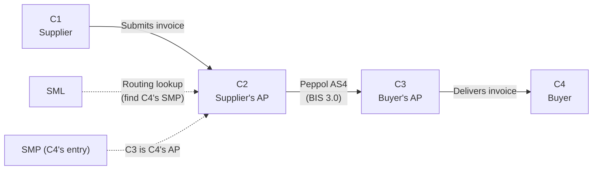

# SC5 — eInvoicing: Scenario Specifications

**WE BUILD consortium | WP2 — UC SC5**

| | |
|---|---|
| **Date** | 2026-04-29 |
| **Version** | 0.7 |
| **Status** | Draft |
| **Author(s)** | Rune Kjørlaug - OpenPeppol |

---

## Index

1. [Introduction](#1-introduction)
   - 1.1 [Objectives of this document suite](#11-objectives-of-this-document-suite)
   - 1.2 [Scenario overview](#12-scenario-overview)
   - 1.3 [Reference documents](#13-reference-documents)
2. [Common concepts and architecture](#2-common-concepts-and-architecture)
   - 2.1 [The Peppol 4-corner model](#21-the-peppol-4-corner-model)
   - 2.2 [Trust enhancement through attestations](#22-trust-enhancement-through-attestations)
   - 2.3 [Common pre-conditions (Peppol-based scenarios)](#23-common-pre-conditions-peppol-based-scenarios)
   - 2.4 [WE BUILD pilot context and qualification model](#24-we-build-pilot-context-and-qualification-model)
   - 2.5 [System-to-system wallet interactions](#25-system-to-system-wallet-interactions)
3. [Roles and participants](#3-roles-and-participants)
   - 3.1 [Actor model summary](#31-actor-model-summary)
   - 3.2 [Pilot compositions](#32-pilot-compositions)
   - 3.3 [Additional roles and partners](#33-additional-roles-and-partners)
   - 3.4 [Target country combinations](#34-target-country-combinations)
   - 3.5 [Requirements](#35-requirements)
4. [Attestations](#4-attestations)
   - 4.1 [Introduction](#41-introduction)
   - 4.2 [Attestations provided by other UCs/WGs](#42-attestations-provided-by-other-ucswgs)
   - 4.3 [Attestations created in SC5](#43-attestations-created-in-sc5)
- [Annex A — Abbreviations](#annex-a--abbreviations)

---

## 1. Introduction

### 1.1 Objectives of this document suite

This document suite describes the scenario specifications for Use Case SC5 (eInvoicing) in Work Package 2 of the WE BUILD consortium. It provides detailed information on the processes to be piloted, the attestations used, the actors involved, and the dependencies on other use cases and work packages.

The suite is organised as follows:

| File | Content |
|------|---------|
| Introduction (this file) | Common introduction, concepts, roles, attestations and abbreviations shared across all scenarios |
| [Scenario 1](Scenario1.md) | Scenario 1 — Supplier pre-approval |
| [Scenario 2](Scenario2.md) | Scenario 2 — Service Provider authorization |
| [Scenario 3](Scenario3.md) | Scenario 3 — Service Provider authorization verifiable by Tax Administration |
| [Scenario 4](Scenario4.md) | Scenario 4 — Direct eInvoicing between Business Wallets |
| [Scenario 5](Scenario5.md) | Scenario 5 — Peppol enhancements |

This suite is a product of the Specification Phase of the WE BUILD LSP and serves as a key input to solution development and pilot preparation.

### 1.2 Scenario overview

The SC5 scenarios share a common foundation where applicable. Scenarios 1, 2, 3 and 5 are built on the Peppol network's 4-corner model, enhanced with European Business Wallet (EBW) attestations to strengthen trust and enable machine-verifiable authorization. Scenario 4 uses the "reference attestation" concept to enable the Buyer's Business Wallet to pull the eInvoice from the Sender, independent on transfer mechanism.

| ID | Scenario name | Attestation(s) | Transport | MVP |
|----|--------------|----------------|-----------|-----|
| 1 | Supplier pre-approval | Approved Supplier | Peppol AS4 | Y |
| 2 | Service Provider authorization | Authorized Service Provider | Peppol AS4 | Y |
| 3 | SP authorization verifiable by Tax Administration | Authorized Service Provider | Peppol AS4 + TA API | MVP+ |
| 4 | Direct eInvoicing between Business Wallets | eInvoice Attestation | OID4VP/DCQL | Y |
| 5 | Peppol enhancements | As per scenarios 1, 2, 3 | Peppol AS4 + ERDS/QERDS | MVP+ |

Scenarios 1, 2 and 4 are part of the Minimum Viable Product (MVP). Scenarios 3 and 5 are designated MVP+.

#### Common pilot flows (Peppol-based scenarios)

The pilot will use real data where possible — real company names and real identifiers — but in the test environment provided by WE BUILD. The aim is to be close to production, but the attestations and wallet instances used will not have any legal effect. The invoice itself can in theory be a genuine invoice, but we will start using the Peppol test environment for transport (where relevant).

We aim to reuse the same actors and processes across Scenarios 1, 2, 3 and 5:

##### Pilot 1 (fake organisations)
The French company "Les roses D´or" has signed a contract with the Dutch tulip provider "Green flowers" that issues an invoice for the first delivery.

##### Pilot 2
Id-union issues an invoice to one of their members cross-border from Germany to Bulgaria.

##### Pilot 3
UPRC buys product x and receives an invoice via GSIS from a B2B router SP.

### 1.3 Reference documents

**WE BUILD project documents**

- SC5 Stock Taking document v1.0 (11/12/2025)
- [WE BUILD Architecture & Integration Blueprint (D4.1)](https://webuild-consortium.github.io/wp4-architecture/blueprint/blueprint.html)
- [WE BUILD Architectural Decision Records (ADRs)](https://github.com/webuild-consortium/wp4-architecture/tree/main/adr) — in particular:
  - ADR: Provide EBWOID as a stable minimal basis
  - ADR: Attestation Revocation Mechanism
  - ADR: Specify PID and eAA formats
  - ADR: Baseline protocols
  - ADR: Deliver business wallet data using QERDS
- [WE BUILD Conformance Specification cs-01: Credential Issuance](https://github.com/webuild-consortium/wp4-architecture/blob/main/conformance-specs/cs-01-credential-issuance.md)
- [WE BUILD Conformance Specification cs-02: Credential Presentation](https://github.com/webuild-consortium/wp4-architecture/blob/main/conformance-specs/cs-02-credential-presentation.md)
- [WE BUILD Attestation Rulebooks catalog](https://github.com/webuild-consortium/webuild-attestation-rulebooks-catalog)
- eInvoice Attestation specification (v0.5 final draft)

**Regulatory and standards**

- ARF (version to be confirmed)
- eIDAS Regulation (amended by 2024/1183) and relevant Implementing Acts
- EBW Regulation proposal
- Peppol BIS Billing 3.0
- Peppol AS4 Profile
- EN 16931 (European e-invoicing standard)
- EWC RB001 — LPID Rulebook (predecessor; EBWOID rulebook to be published under WE BUILD)
- EWC RB002 — EUCC Rulebook
- OpenID4VCI (latest version)
- OpenID4VP (latest version)
- SD-JWT-VC specification
- W3C Verifiable Credentials Data Model (VCDM)
- IETF Token Status List (revocation)
- ETSI TS 119 602 — List of Trusted Entities (LoTE)

---

## 2. Common concepts and architecture

### 2.1 The Peppol 4-corner model

All Peppol-based scenarios (1, 2, 3 and 5) operate within the standard 4-corner model:

- **C1** — Sending end user (Supplier): creates and sends the invoice
- **C2** — Sending Service Provider (Access Point): transmits the invoice on behalf of C1
- **C3** — Receiving Service Provider (Access Point): receives the invoice on behalf of C4
- **C4** — Receiving end user (Buyer): receives and processes the invoice

Invoice exchange follows the Peppol BIS 3.0 format over AS4. C2 resolves the delivery endpoint for a given invoice by querying the SML to find C4's SMP, which returns C3 as the AP authorised to receive on C4's behalf. SC5 does not change the transport layer — it adds verifiable trust signals at key decision points in the flow.

> **Note on receipts (MLR/MLS):** The current Peppol specification does not mandate an application-level receipt from C4 back to C1 confirming that an invoice has been processed or accepted. The AS4 transport acknowledgement between C3 and C2 is the only standardised confirmation. Work is ongoing within the Peppol community on **Message Level Response (MLR)** and **Message Level Status (MLS)** to introduce a standardised business-level receipt mechanism. SC5 should monitor this work, as a future MLR/MLS could carry attestation-related metadata — for instance, confirming that C4 accepted the invoice against a valid Approved Supplier attestation — and would close a significant gap in the end-to-end trust chain.

### 2.2 Trust enhancement through attestations

The core idea of SC5 (Peppol-based scenarios) is that the invoice itself remains unchanged (Peppol BIS 3.0), while wallet-based attestations provide verifiable, machine-readable proof of authorization at specific steps. This is a non-intrusive enhancement: it does not require changes to the Peppol transport or message format.

Two new attestation types are introduced for the Peppol-based scenarios:

- **Approved Supplier attestation** — issued by a Buyer (C4) to a Supplier (C1), proving the existence of a trusted and acknowledged contractual relationship between the two legal entities. The parties are implicitly determined by the Wallet Instances involved, each bound to a verified legal entity. The attestation may be grounded in a public authoritative source (e.g. a contract award notice on TED) or in contractual evidence or buyer acknowledgement.
- **Authorized Service Provider attestation** — issued by a company (C1 or C4) to its Service Provider (C2 or C3), proving that the SP is authorised to act on the company's behalf for one or more explicitly defined functions, including sending or receiving electronic invoices, and submitting VAT or transaction data to tax authorities. Legal identity of the mandating business and the SP is not asserted in the attestation itself; it is established through separate legal person attestations (e.g. EUCC).

Both attestation types are Electronic Attestations of Attributes (EAA) in the sense of eIDAS 2.0. Whether they need to be Qualified (QEAA) is a working assumption pending further analysis.

Scenario 4 introduces a third type:

- **eInvoice Attestation** — a verifiable representation of an invoice exchange event, issued by the Supplier's Business Wallet, binding invoice content (via a payload hash) to a cryptographic signature associated with the Supplier's legal-person identity. In the regulation this is called a reference attestation.

### 2.3 Common pre-conditions (Peppol-based scenarios)

The following pre-conditions apply across all Peppol-based SC5 scenarios (1, 2, 3 and 5):

1. C1 (Supplier) and C4 (Buyer) are registered Peppol participants with entries in the SMP. C4's SMP entry records C3 as the Access Point authorised to receive documents on C4's behalf; C1's SMP entry records C2 similarly. C2 and C3 do not have their own SMP entries — they are service providers acting on behalf of their clients.
2. C2 and C3 are certified Peppol Access Points.
3. European Business Wallets are available and operational for C1, C4, and the SPs as applicable; wallet providers have passed ITB testing.
4. EBWOID attestations are issued to the relevant business wallets by WP4-designated EBWOID providers.
5. WP4 trust infrastructure is operational: the WE BUILD LoTL, WE BUILD Trusted Lists, and relying party registration are available.
6. The Approved Supplier and Authorized Service Provider attestation schemas and rulebooks are defined (to be delivered by SC5 in coordination with the WP4 semantics group and published in the WE BUILD Attestation Rulebooks catalog).
7. Issuers, Holders and Verifiers implement the WE BUILD Conformance Specifications cs-01 (issuance) and cs-02 (presentation) for the above attestation types.
8. Revocation infrastructure for SC5 attestations is operational, using the IETF Token Status List mechanism as mandated by the WE BUILD ADR on Attestation Revocation.

### 2.4 WE BUILD pilot context and qualification model

SC5 operates within the WE BUILD pilot environment, which is a large-scale test environment and not the final eIDAS production ecosystem. This has specific implications for how trust and qualification are handled in the pilot, as documented in the Blueprint (D4.1, section 1.2.1).

| WE BUILD does **not** | WE BUILD **does** |
|----------------------|-------------------|
| Issue eIDAS-qualified attestations (QEAA) | Define WE BUILD QEAA focused on technical interoperability |
| Use the EC List of Trusted Lists (LoTL) | Provide a WE BUILD LoTL |
| Use MS Trusted Lists | Provide WE BUILD Trusted Lists with input from supervisory bodies where available |
| Issue eIDAS RP access certificates | Issue WE BUILD RP access certificates |
| Reach production-level legal liability | Operate within the WE BUILD agreement and trust framework |

Consequently, any reference in this document suite to "QEAA" in the pilot context means **WE BUILD QEAA**: a technically interoperable credential that follows eIDAS patterns and passes the Interoperability Testbed (ITB), but does not carry eIDAS legal qualification.

All SC5 implementations — wallet providers, issuers, verifiers — must pass the ITB before participating in pilots. The WBCS (cs-01 for issuance, cs-02 for presentation) define the technical requirements that implementations must conform to.

### 2.5 System-to-system wallet interactions

The Peppol-based SC5 scenarios involve machine-to-machine flows between backend systems (Access Points), not direct end-user interactions. As noted in the Blueprint (section 4.5), enterprise and system-to-system wallet interactions are fully supported: credential issuance and presentation may be initiated by backend systems, while the same trust framework, credential formats and verification mechanisms apply as in user-driven flows.

This is directly applicable to SC5: C2 acts as a Verifier in a fully automated pipeline when it checks attestations on incoming invoice submissions. The OpenID4VP exchange between C1's EBW and C2, or between C2 and C3, is a system-to-system interaction with no human-in-the-loop required at runtime.

---

## 3. Roles and participants

### 3.1 Actor model summary

| Business actor | ARF role | Scenarios |
|---------------|----------|-----------|
| Buyer (C4) | Issuer (Approved Supplier; Authorized SP for C3) | 1, 2, 3, 5 |
| Supplier (C1) | Holder/Presenter (Approved Supplier); Issuer (Authorized SP for C2, eInvoice to C4) | 1, 2, 3, 4, 5 |
| Supplier's AP (C2) | Verifier (Approved Supplier); Holder/Presenter (Authorized SP) | 1, 2, 3, 5 |
| Buyer's AP (C3) | Verifier (Authorized SP from C1/C2); Holder/Presenter (Authorized SP from C4) | 2, 3, 5 |
| Tax Authority (MS A / MS B) | Verifier (Authorized SP attestation for tax reporting) | 3 |
| Supplier (Business Wallet) | Issuer (eInvoice Attestation) | 1, 2, 3, 4, 5 |
| Buyer (Business Wallet) | Holder/Verifier (eInvoice Attestation) | 1, 2, 3, 4, 5 |
| QTSP | Trust service provider (QESeal, ERDS/QERDS) | 5 |

### 3.2 Pilot compositions

#### Pilot 1 (Scenarios 1, 2, 3, 5)

| Primary role | UC partner name | Country |
|-------------|----------------|---------|
| Supplier (C1) | "Green flowers" (fake) | Netherlands |
| Buyer (C4) | "Les roses D´or" (fake) | France |
| Supplier's AP (C2) | Banqup | |
| Buyer's AP (C3) | Semansys | |
| EBW provider (Supplier) | Banqup | |
| EBW provider (Buyer) | Sphereon | |

#### Pilot 2 (Scenarios 1, 2, 3, 5)

| Primary role | UC partner name | Country |
|-------------|----------------|---------|
| Supplier (C1) | IdUnion | Germany |
| Buyer (C4) | TBD | Bulgaria |
| Supplier's AP (C2) | Datev | |
| Buyer's AP (C3) | B2B Router? | |
| EBW provider (Supplier) | TBD (from IdUnion) | |
| EBW provider (Buyer) | TBD (from IdUnion) | |

#### Pilot 3 (Scenarios 1, 2, 3, 5)

| Primary role | UC partner name | Country |
|-------------|----------------|---------|
| Supplier (C1) | TBD (by B2B router) | Spain? |
| Buyer (C4) | UPRC | Greece |
| Supplier's AP (C2) | B2B router | |
| Buyer's AP (C3) | GSIS | Greece |
| EBW provider (Supplier) | ValidateID | |
| EBW provider (Buyer) | GU-net | |

#### Pilot 4 (Scenario 4)

| Primary role | UC partner name | Country |
|-------------|----------------|---------|
| Supplier | Robert Bosch | DE |
| Supplier | Sphereon | NL |
| Buyer (Relying party) | Robert Bosch | DE |

### 3.3 Additional roles and partners

| Primary role | UC partner name | Country | Wallet |
|-------------|----------------|---------|--------|
| Tax authority (Supplier side) | TBD | | |
| Tax authority (Buyer side) | TBD | | |
| EU Business Wallet provider | Sphereon & Credenco | NL | |
| EUCC/LPID Provider | (out of scope) | | |
| Trusted list registrar | IDunion SCE | DE | |
| QEAA provider | (out of scope) | | |
| Pub-EAA provider | (out of scope) | | |
| EAA provider | Datev | DE | |
| QES provider | ValidatedID, Banqup | ES, BE | |

### 3.4 Target country combinations

#### Peppol-based scenarios (1, 2, 3, 5)

| Sending MS \ Receiving MS | France | Netherlands | Germany | Bulgaria | Spain | Greece |
|--------------------------|--------|-------------|---------|----------|-------|--------|
| France | — | Y | | | | |
| Netherlands | Y | — | | | | |
| Germany | | | — | Y | | |
| Bulgaria | | | Y | — | | |
| Spain | | | | | — | Y |
| Greece | | | | | Y | — |

### 3.5 Requirements

The main functional, organizational and technical requirements for each role are included in Annex 1 of each individual scenario file.

---

## 4. Attestations

### 4.1 Introduction

SC5 introduces three new attestation types that do not currently exist in the EUDI ecosystem or any other standard. This section provides an overview. Full schemas and claim definitions are included in the relevant scenario specification files and will be detailed in dedicated attestation rulebooks.

SC5 reuses the EBWOID (for identifying companies) as a dependency from WP4, but the new attestation types must be specified, schematized and governed by SC5 in coordination with the WP4 semantics group.

### 4.2 Attestations provided by other UCs/WGs

| Attestation name | Short description | To be provided by | Requirements |
|-----------------|-------------------|------------------|--------------|
| EBWOID | European Business Wallet Organisation Identifier — the cross-border minimum organisation identifier in the WE BUILD ecosystem, providing a stable, wallet-bound basis for identifying legal persons across Member States. Successor to the LPID concept from earlier LSPs. | WP4 — PID & EBWOID Providers group | Must include: EUID (ISO 6523-compliant), legal name, registered address, VAT number (where applicable). Used to uniquely identify C1, C2, C3 and C4 in attestation subject/issuer fields. Availability in all piloting Member States is a critical path dependency. |
| EUCC | EU Company Certificate; richer set of company attributes | WP4 / EWC RB002 | Optional enhancement for richer verification; not required for MVP. |

### 4.3 Attestations created in SC5

#### [Approved Supplier attestation](../Attestations/ApprovedSupplier.md) (Scenarios 1, 4, 5)

| Attribute | Value |
|-----------|-------|
| **Issuer** | Buyer (C4) |
| **Holder / subject** | Supplier (C1) |
| **Verifier** | Supplier's AP (C2) |
| **ARF attestation type** | EAA (QEAA pending analysis) |
| **Credential format** | SD-JWT-VC |

The parties (Buyer and Supplier) are implicitly determined by the Wallet Instances involved and are not embedded as explicit identity claims in the attestation. Legal identity is established through separate attestations (e.g. EUCC).

**Key attributes (from attestation spec):**

| Attribute | M/O | Description |
|-----------|-----|-------------|
| `relationship_id` | M | Unique identifier of the acknowledged relationship |
| `relationship_type` | M | Type of relationship (code list: `contractual`, `framework_agreement`, `public_contract_award`, `private_contract`, `buyer_acknowledgement`) |
| `relationship_status` | M | Current status — SHALL be `active` for eInvoicing trust decisions |
| `relationship_start_date` | M | Start date of the acknowledged relationship |
| `relationship_end_date` | O | End date of the relationship, if applicable |
| `authoritative_source` | O | Reference to the authoritative source or evidence (Source reference object) |

#### [Authorized Service Provider attestation](../Attestations/AuthorizedServiceProvider.md) (Scenarios 2, 3, 5)

| Attribute | Value |
|-----------|-------|
| **Issuer** | Company (C1 or C4) |
| **Holder / subject** | Service Provider (C2 or C3) |
| **Verifier** | Counterpart AP (C3 or C2); Tax Authority (Scenario 3) |
| **ARF attestation type** | EAA (QEAA pending analysis) |
| **Credential format** | SD-JWT-VC |

Legal identity of the mandating business and the service provider is NOT asserted in this attestation — it SHALL be established through separate legal person attestations (e.g. EUCC). The mandating business is referenced via a structured object containing its VAT number and country code, sufficient for relying party processing.

**Key attributes (from attestation spec):**

| Attribute | M/O | Description |
|-----------|-----|-------------|
| `mandate_id` | M | Unique identifier of the mandate |
| `mandate_type` | M | Type of mandate (code list: `invoice_sending`, `invoice_receiving`, `vat_reporting`, `transaction_reporting`) |
| `mandate_start_date` | M | Start date of the mandate |
| `mandate_end_date` | O | End date of the mandate, if applicable |
| `mandating_business` | M | Reference to the mandating business (Mandating business reference object: `vat_number` M, `country_code` M, `business_identifier` O) |
| `mandate_scope` | M | Scope within which the SP is authorised to act (Mandate scope object: `scope_type` M from code list `einvoicing` / `vat_reporting` / `regulatory_reporting`; `vat_reporting_scope` O) |
| `authority_source` | O | Reference to the authentic source supporting the mandate (Authority reference object) |

#### [eInvoice Attestation](../Attestations/eInvoice.md) (Scenario 4)

| Attribute | Value |
|-----------|-------|
| **Issuer** | Supplier (via Supplier Wallet) |
| **Holder / subject** | Buyer Wallet |
| **Verifier** | Buyer Wallet |
| **ARF attestation type** | EAA |
| **Credential format** | SD-JWT-VC |
| **Applicable domain standards** | EN16931-UBL and/or Peppol BIS3 |

---

## Annex A — Abbreviations

| Abbreviation | Definition |
|-------------|-----------|
| AP | Access Point |
| ARF | Architecture Reference Framework |
| B2B | Business-to-Business |
| B2G | Business-to-Government |
| BIS | Business Interoperability Specification |
| EAA | Electronic Attestation of Attributes |
| EBW | European Business Wallet |
| EUID | European Unique Identifier |
| EUCC | EU Company Certificate |
| KYB | Know Your Business |
| KYS | Know Your Supplier |
| ADR | Architectural Decision Record |
| CIUS | Core Invoice Usage Specification |
| ERDS | Electronic Registered Delivery Service |
| EBWOID | European Business Wallet Organisation Identifier |
| ITB | Interoperability Testbed |
| LoTL | List of Trusted Lists |
| LoTE | List of Trusted Entities |
| UBL | Universal Business Language |
| LSP | Large Scale Pilot |
| MVP | Minimum Viable Product |
| OpenID4VCI | OpenID for Verifiable Credential Issuance |
| OpenID4VP | OpenID for Verifiable Presentations |
| PKI | Public Key Infrastructure |
| QEAA | Qualified Electronic Attestation of Attributes |
| QERDS | Qualified Electronic Registered Delivery Service |
| QES | Qualified Electronic Signature |
| QESeal | Qualified Electronic Seal |
| QTSP | Qualified Trust Service Provider |
| SD-JWT-VC | Selective Disclosure JWT Verifiable Credential |
| SML | Service Metadata Locator |
| SMP | Service Metadata Publisher |
| SP | Service Provider |
| TDD | Tax Data Document |
| VAT | Value Added Tax |
| VCDM | Verifiable Credentials Data Model |
| ViDA | VAT in the Digital Age |
| WP | Work Package |
| WBCS | WE BUILD Conformance Specification |
