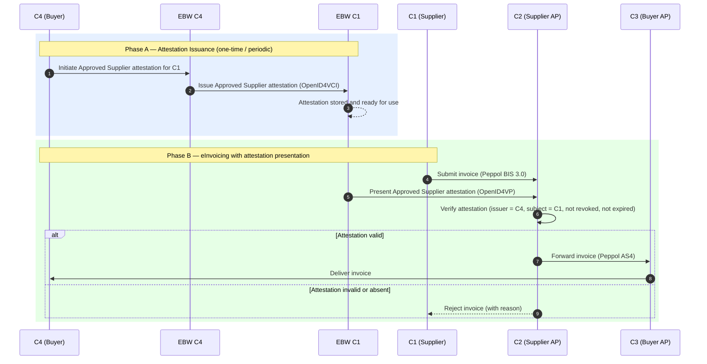

# SC5 — Scenario 1: Supplier Pre-Approval

**WE BUILD consortium | WP2 — UC SC5**

| | |
|---|---|
| **Date** | 2026-04-29 |
| **Version** | 0.7 |
| **Status** | Draft |
| **Author(s)** | Rune Kjørlaug - OpenPeppol |

> **Part of the SC5 eInvoicing specification suite.** Read [SC5_Introduction.md](SC5_Introduction.md) for common concepts, roles, attestations and abbreviations.

---

## Index

1. [Introduction](#1-introduction)
2. [Pre-conditions](#2-pre-conditions)
3. [Main flow](#3-main-flow)
4. [Detailed scenario flow](#4-detailed-scenario-flow)
5. [Additional flows](#5-additional-flows)
6. [Challenges and barriers](#6-challenges-and-barriers)
7. [Working assumptions](#7-working-assumptions)
- [Annex 1 — Requirements for scenario roles](#annex-1--requirements-for-scenario-roles)

---

## 1. Introduction

Scenario 1 introduces the **Approved Supplier attestation** as a mechanism for a Buyer (C4) to pre-approve a Supplier (C1) and make this approval verifiable at the Service Provider level (C2). When C1 submits an invoice, C2 can verify — before transmitting — that C1 holds a valid approval from C4. This prevents unauthorized or fraudulent invoices from entering the Peppol network on behalf of buyers who have not established a commercial relationship with the sending supplier.

This scenario establishes the foundational buyer-supplier trust relationship and is the primary **MVP** scenario.

---

## 2. Pre-conditions

In addition to the common pre-conditions (SC5_Introduction.md, section 2.3):

1. C4 has an operational EBW capable of issuing the Approved Supplier attestation.
2. C1 has an EBW capable of receiving and presenting the Approved Supplier attestation.
3. C2 is a Verifier/Relying Party capable of verifying the Approved Supplier attestation via OpenID4VP.
4. The Approved Supplier attestation schema is available and accepted by all parties.
5. C4 has established a commercial relationship with C1 outside of the wallet system (e.g. via a procurement process) and is ready to attest to it.

---

## 3. Main flow

The flow consists of two phases: an **attestation issuance phase** (typically a one-time or periodic activity) and the **invoice submission phase** (recurring).

---

## 4. Detailed scenario flow

| Step | Actor | Description | Dependencies | Variations / exceptions |
|------|-------|-------------|--------------|------------------------|
| A.1 | C4 | C4 initiates the issuance of an Approved Supplier attestation for C1 through their EBW interface. The attestation identifies C1 (via EBWOID / EUID) as an approved supplier of C4. | EBWOID for C1 must be resolvable by C4 | C4 may issue the attestation for a limited validity period or with product/category scope |
| A.2 | EBW C4 → EBW C1 | The EBW of C4 (acting as Issuer) issues the attestation to the EBW of C1 using OpenID4VCI. The attestation is signed by C4 and bound to C1's wallet. | OpenID4VCI interoperability between wallets; Approved Supplier schema available | Batch issuance for multiple suppliers; delegation to procurement platform |
| A.3 | EBW C1 | C1's EBW stores the attestation. C1 is notified. | — | C1 may have multiple Approved Supplier attestations from different buyers |
| B.1 | C1 | C1 creates the invoice in Peppol BIS 3.0 format and initiates submission to C2. As part of the submission handshake, C1 presents the Approved Supplier attestation for the relevant buyer (C4) via OpenID4VP. | Approved Supplier attestation in EBW C1; C2 supports OpenID4VP verification | C1 may present the attestation out-of-band (API call separate from invoice submission); scope to be defined |
| B.2 | C2 | C2 acts as Verifier/Relying Party. It verifies: (a) the attestation signature (issuer = C4), (b) the subject matches C1, (c) the attestation is within its validity period, (d) the attestation has not been revoked. | Trust registry accessible to C2; revocation endpoint operational | C2 may cache verification results for a configurable period to avoid repeated checks |
| B.3a | C2 → C3 | If verification succeeds, C2 forwards the invoice to C3 via Peppol AS4. C2 resolves the recipient by looking up C4's Peppol ID in the SML/SMP, which returns C3 as the AP authorised to receive on C4's behalf. | C4 registered in SMP with C3 as receiving AP | C2 may attach attestation metadata to the AS4 message (optional, to be specified) |
| B.3b | C2 → C1 | If verification fails (invalid, absent, expired, revoked), C2 rejects the invoice and returns an error to C1 with a standardized reason code. | — | Reason codes: ATTESTATION_MISSING, ATTESTATION_INVALID, ATTESTATION_EXPIRED, ATTESTATION_REVOKED |
| B.4 | C3 → C4 | C3 delivers the invoice to C4 using the agreed delivery mechanism. | — | — |
| B.5 | C3 → C2 → C1 | C3 returns an AS4-level acknowledgement to C2; C2 confirms submission to C1. There is no mandatory application-level receipt from C4 back to C1 in the current Peppol specification. Work on MLR/MLS is ongoing and may introduce a standardised receipt mechanism; SC5 should monitor this and consider it for Scenario 5. | — | If MLR/MLS becomes available, C4's receipt could carry attestation-related metadata confirming the invoice was accepted against a valid Approved Supplier attestation |

---

## 5. Additional flows

| Variation/exception | Description |
|--------------------|-------------|
| Attestation renewal | If the Approved Supplier attestation has expired, C1 must request renewal from C4 before submitting invoices. C2 rejects the invoice with reason ATTESTATION_EXPIRED. |
| Multi-buyer scenario | C1 may hold multiple Approved Supplier attestations (one per buyer). C2 selects the relevant one based on C4's Peppol ID present in the invoice. |
| Attestation revocation | C4 may revoke the attestation at any time (e.g. if the commercial relationship ends). C2 checks revocation status on each submission or on a cached basis. |

The following will **not** be piloted in Scenario 1: proximity-based presentation, natural person wallet flows, and changes to the Peppol message format itself.

---

## 6. Challenges and barriers

- **No existing Approved Supplier attestation schema**: a new EAA schema and rulebook must be designed from scratch, in coordination with WP4 (semantics group).
- **Wallet interoperability**: the Buyer's EBW and the Supplier's EBW may be from different providers; cross-wallet OpenID4VCI issuance must be tested.
- **C2 integration**: Peppol Access Points must be extended to act as OpenID4VP Verifiers; this requires changes to their onboarding and operational software.
- **Revocation infrastructure**: revocation of the Approved Supplier attestation must be implemented using the IETF Token Status List, as mandated by the WE BUILD ADR on Attestation Revocation. Attestations with a validity period ≤ 24 hours are exempt from revocation requirements; longer-lived attestations (expected for the Approved Supplier relationship) require a live Token Status List endpoint accessible to C2.
- **EBWOID availability**: issuance of EBWOIDs in all piloting Member States is required before Scenario 1 can be piloted cross-border.

---

## 7. Working assumptions

| # | Assumption | Rationale |
|---|-----------|-----------|
| WA1.1 | The Approved Supplier attestation is implemented as a non-qualified EAA (not QEAA) for the MVP pilot. | A QEAA mandate would require QTSP involvement and may not be feasible within pilot timelines. This can be escalated for production. |
| WA1.2 | C2 is the primary Verifier for the attestation; C3 does not verify in Scenario 1. | Placing verification at C2 prevents unauthorized invoices from entering the network at the source. Adding C3 verification is a Scenario 2 / Scenario 5 enhancement. |
| WA1.3 | The attestation is presented via a machine-to-machine OpenID4VP flow, not a browser-based user interaction. | The invoice submission process in Peppol is automated; human-in-the-loop wallet interactions are not appropriate for production invoice flows. |
| WA1.5 | In the WE BUILD pilot, "QEAA" means WE BUILD QEAA (technically interoperable, ITB-tested) rather than eIDAS-qualified. | The WE BUILD pilot environment does not operate within the formal eIDAS certification framework. Production escalation to eIDAS QEAA is a post-pilot decision. |

---

## Annex 1 — Requirements for scenario roles

> ⚠️ *To be completed during specification phase based on partner input.*

| Primary role | Specific requirement |
|-------------|---------------------|
| 1. Supplier (C1) | a. Must have an operational European Business Wallet |
| | b. EBW must support OpenID4VP (presentation) |
| | c. Must be a registered Peppol participant |
| 2. Buyer (C4) | a. Must have an operational European Business Wallet |
| | b. EBW must support OpenID4VCI (issuance of Approved Supplier attestation) |
| | c. Must be a registered Peppol participant |
| 3. Supplier's AP (C2) | a. Must be a certified Peppol Access Point |
| | b. Must support OpenID4VP as Verifier (Approved Supplier attestation) |
| 4. EBW provider | a. Must support OpenID4VCI issuance per WBCS cs-01 |
| | b. Must support OpenID4VP presentation per WBCS cs-02 |
| | c. Must pass ITB conformance testing before participating in pilots |
| 5. EBWOID provider | a. As per WP4 requirements |
| 6. Trust registry / Trusted list registrar | a. Must register Issuers of Approved Supplier attestations |
