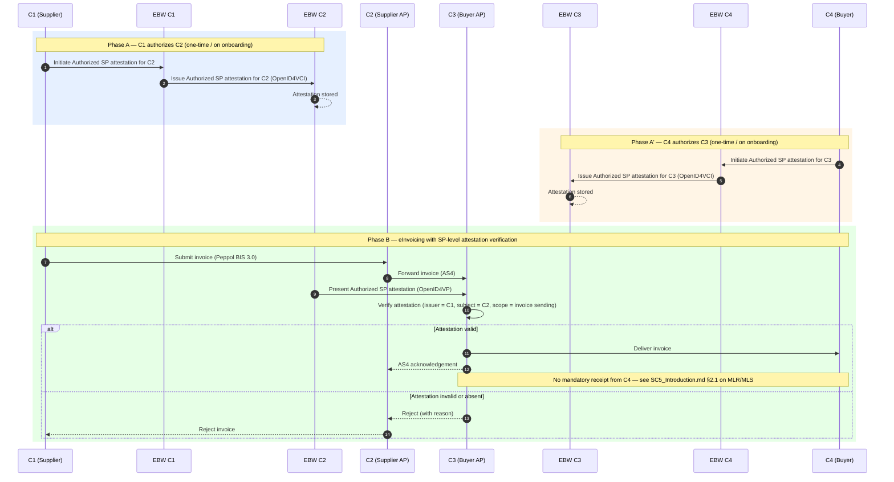

# SC5 — Scenario 2: Service Provider Authorization

**WE BUILD consortium | WP2 — UC SC5**

| | |
|---|---|
| **Date** | 2026-04-29 |
| **Version** | 0.7 |
| **Status** | Draft |
| **Author(s)** | Rune Kjørlaug - OpenPeppol |

> **Part of the SC5 eInvoicing specification suite.** Read [SC5_Introduction.md](SC5_Introduction.md) for common concepts, roles, attestations and abbreviations.

---

## Index

1. [Introduction](#1-introduction)
2. [Pre-conditions](#2-pre-conditions)
3. [Main flow](#3-main-flow)
4. [Detailed scenario flow](#4-detailed-scenario-flow)
5. [Additional flows](#5-additional-flows)
6. [Challenges and barriers](#6-challenges-and-barriers)
7. [Working assumptions](#7-working-assumptions)
- [Annex 1 — Requirements for scenario roles](#annex-1--requirements-for-scenario-roles)

---

## 1. Introduction

Scenario 2 introduces the **Authorized Service Provider attestation**, issued by a company (C1 or C4) to its Service Provider (C2 or C3 respectively). This allows the receiving AP (C3) to verify — before accepting an invoice — that the sending AP (C2) is legitimately authorized to act on behalf of the sending company (C1).

This adds an additional layer of trust between the APs, complementing Scenario 1's buyer-supplier trust. It guards against unauthorized or misconfigured APs transmitting invoices without a valid mandate from the company they claim to represent.

This is an **MVP** scenario.

---

## 2. Pre-conditions

In addition to the common pre-conditions (SC5_Introduction.md, section 2.3):

1. C1 has an EBW capable of issuing the Authorized Service Provider attestation to C2.
2. C4 has an EBW capable of issuing the Authorized Service Provider attestation to C3 (required if C3-side verification is piloted).
3. C2 and C3 have EBWs (or equivalent wallet-capable infrastructure) to receive and present attestations.
4. C3 is a Verifier capable of verifying the Authorized Service Provider attestation presented by C2.
5. The Authorized Service Provider attestation schema is available and accepted by all parties.

---

## 3. Main flow

---

## 4. Detailed scenario flow

| Step | Actor | Description | Dependencies | Variations / exceptions |
|------|-------|-------------|--------------|------------------------|
| A.1 | C1 | C1 initiates the issuance of an Authorized SP attestation for C2 via C1's EBW. The attestation certifies that C2 is authorized to send invoices on behalf of C1. | EBWOID for C2 must be resolvable; Authorized SP schema available | Attestation may be scoped to specific document types or Peppol process IDs |
| A.2 | EBW C1 → EBW C2 | C1's EBW issues the attestation to C2's EBW via OpenID4VCI. | OpenID4VCI interoperability | — |
| A'.1 | C4 | C4 issues an Authorized SP attestation for C3 (mirror of A.1 on the receiving side). | — | This step is optional for the MVP; see WA2.1 |
| B.1 | C1 → C2 | C1 submits invoice to C2 through normal Peppol onboarding channel. | — | Optionally combined with Scenario 1 attestation presentation |
| B.2 | C2 → C3 | C2 sends the invoice to C3 via Peppol AS4. As part of the AS4 exchange (or a preceding handshake), C2 presents its Authorized SP attestation to C3 via OpenID4VP. | C3 supports OpenID4VP; trust registry accessible | Timing of attestation presentation (before AS4, during AS4 header, or as separate API call) to be specified |
| B.3 | C3 | C3 verifies: (a) attestation issuer = C1, (b) subject = C2, (c) validity period, (d) not revoked, (e) scope covers invoice transmission. | Trust registry; revocation endpoint | C3 may also verify C4 has authorized it (if A' was performed) |
| B.4a | C3 → C4 | If valid, C3 delivers to C4. | — | — |
| B.4b | C3 → C2 | If invalid, C3 rejects with reason code. C2 notifies C1. | — | — |

---

## 5. Additional flows

| Variation/exception | Description |
|--------------------|-------------|
| SP change | When C1 changes to a new AP, the old Authorized SP attestation must be revoked and a new one issued. |
| Mutual verification | C2 may request to verify C3's authorization (C4 → C3) before sending. This symmetric trust model may be mandated in Scenario 5. |

---

## 6. Challenges and barriers

- **Wallet for Service Providers**: APs need EBWs or equivalent infrastructure to hold and present attestations. This is a significant change to current AP software and operational practice.
- **AS4 integration point**: defining where exactly attestation presentation fits into the AS4 message exchange is a key technical design question requiring alignment with the Peppol AS4 profile owners.
- **Schema alignment with Scenario 1**: the Authorized SP attestation schema must be designed to complement the Approved Supplier attestation without creating redundancy.

---

## 7. Working assumptions

| # | Assumption | Rationale |
|---|-----------|-----------|
| WA2.1 | For the MVP, only the C2-to-C3 verification is piloted (C2 presents attestation from C1 to C3). C3's authorization by C4 is MVP+. | Reduces scope and partner complexity for the MVP. The asymmetric model still provides meaningful fraud prevention. |
| WA2.2 | Attestation presentation by C2 to C3 occurs as a pre-transmission handshake, not embedded in the AS4 message itself. | Avoids changes to the Peppol AS4 message format. The handshake can be an OpenID4VP exchange triggered before the AS4 SUBMIT call. |

---

## Annex 1 — Requirements for scenario roles

> ⚠️ *To be completed during specification phase based on partner input.*

| Primary role | Specific requirement |
|-------------|---------------------|
| 1. Supplier (C1) | a. Must have an operational European Business Wallet |
| | b. EBW must support OpenID4VCI (issuance of Authorized SP attestation) |
| | c. Must be a registered Peppol participant |
| 2. Buyer (C4) | a. Must have an operational European Business Wallet |
| | b. EBW must support OpenID4VCI (issuance of Authorized SP attestation to C3) |
| | c. Must be a registered Peppol participant |
| 3. Supplier's AP (C2) | a. Must be a certified Peppol Access Point |
| | b. Must have an EBW for holding and presenting Authorized SP attestation |
| | c. Must support OpenID4VP as Holder/Presenter |
| 4. Buyer's AP (C3) | a. Must be a certified Peppol Access Point |
| | b. Must support OpenID4VP as Verifier (Authorized SP attestation) |
| | c. Must have an EBW for holding Authorized SP attestation (MVP+) |
| 5. EBW provider | a. Must support OpenID4VCI issuance per WBCS cs-01 |
| | b. Must support OpenID4VP presentation per WBCS cs-02 |
| | c. Must pass ITB conformance testing before participating in pilots |
| 6. EBWOID provider | a. As per WP4 requirements |
| 7. Trust registry / Trusted list registrar | a. Must register Issuers of Authorized SP attestations |
