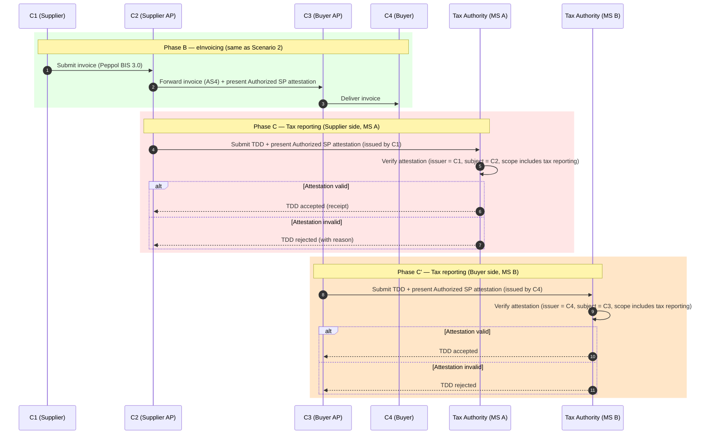

# SC5 — Scenario 3: Service Provider Authorization Verifiable by Tax Administration

**WE BUILD consortium | WP2 — UC SC5**

| | |
|---|---|
| **Date** | 2026-04-29 |
| **Version** | 0.7 |
| **Status** | Draft |
| **Author(s)** | Rune Kjørlaug - OpenPeppol |

> **Part of the SC5 eInvoicing specification suite.** Read [Introduction.md](Introduction.md) for common concepts, roles, attestations and abbreviations.

---

## Index

1. [Introduction](#1-introduction)
2. [Pre-conditions](#2-pre-conditions)
3. [Main flow](#3-main-flow)
4. [Detailed scenario flow](#4-detailed-scenario-flow)
5. [Challenges and barriers](#5-challenges-and-barriers)
6. [Working assumptions](#6-working-assumptions)
- [Annex 1 — Requirements for scenario roles](#annex-1--requirements-for-scenario-roles)

---

## 1. Introduction

Scenario 3 extends the Authorized Service Provider attestation from Scenario 2 to the tax reporting context under **ViDA (VAT in the Digital Age)**. ViDA requires that structured invoice data be reported to tax authorities in (near) real time. In the Peppol network, this reporting will often be done by the AP (C2 or C3) on behalf of the company they represent, not by the company directly.

Scenario 3 ensures that a Tax Authority can verify that the SP submitting tax-related data on behalf of a company is genuinely authorized to do so, using the same Authorized Service Provider attestation defined in Scenario 2 — extended with a `vida:tax_report` scope attribute.

This scenario is designated **MVP+**.

---

## 2. Pre-conditions

In addition to the Scenario 2 pre-conditions:

1. C2 holds an Authorized SP attestation from C1 (as in Scenario 2), with `vida:tax_report` in its scope.
2. C3 holds an Authorized SP attestation from C4 (as in Scenario 2, Phase A'), with `vida:tax_report` in its scope.
3. Tax Authorities in the piloting Member States are reachable via a defined API endpoint and are capable of verifying EBW attestations.
4. The Tax Data Document (TDD) format used in the pilot is aligned with the Peppol ViDA pilot outputs. SC5 will adopt the format and process definitions from that pilot rather than specifying them independently.
5. The Peppol ViDA pilot is sufficiently advanced to provide a reference TDD format and reporting process for SC5 to build on.

---

## 3. Main flow

The invoice exchange flow (Phase B) is identical to Scenario 2. The additional steps relate to tax reporting, triggered after invoice delivery.

---

## 4. Detailed scenario flow

| Step | Actor | Description | Dependencies | Variations / exceptions |
|------|-------|-------------|--------------|------------------------|
| B.1–B.4 | As Scenario 2 | Invoice exchange proceeds as in Scenario 2. | See Scenario 2 | — |
| C.1 | C2 | Following invoice transmission, C2 prepares a Tax Data Document (TDD) for submission to the Tax Authority of MS A (C1's home country). C2 presents its Authorized SP attestation (issued by C1) alongside the TDD. | Authorized SP attestation includes tax reporting scope; TA API available | Timing: real-time alongside invoice, or near-real-time batch |
| C.2 | TA_A | Tax Authority verifies: (a) issuer = C1, (b) subject = C2, (c) attestation scope covers tax reporting, (d) validity and revocation status. | TA connected to trust registry | TA may request additional claims (e.g. VAT registration number) |
| C.3a | TA_A → C2 | If valid, TA accepts TDD and returns a signed receipt. | — | Receipt can serve as proof of reporting obligation fulfilled |
| C.3b | TA_A → C2 | If invalid, TA rejects TDD with reason. C2 must resolve (re-obtain attestation or escalate). | — | — |
| C'.1–C'.3 | C3, TA_B | Mirror of C.1–C.3 on the buyer side (MS B). C3 reports using its attestation from C4. | — | MS B may be the same as MS A in domestic invoicing scenarios |

---

## 5. Challenges and barriers

- **Alignment with the Peppol ViDA pilot**: Peppol is actively engaged in a dedicated ViDA pilot in which invoice formats, Tax Data Document structures, and reporting processes are being defined and tested. SC5 Scenario 3 must align with and reference the outputs of that pilot rather than developing parallel specifications. The Peppol ViDA pilot is the primary reference point for the TDD format, reporting triggers, and the interface between the Peppol network and tax authority endpoints used in this scenario.
- **Tax Authority readiness**: Tax Authorities in piloting Member States must build or adapt API endpoints capable of receiving and verifying EBW attestations. This is a significant dependency outside the consortium.
- **Scope attribute in attestation**: the Authorized SP attestation from Scenario 2 must include a scope attribute that explicitly covers tax reporting. This must be reflected in the schema.
- **Cross-border ViDA rules**: when C1 and C4 are in different Member States, the reporting rules may differ. The scenario must be designed to handle both same-country and cross-border invoice flows.

---

## 6. Working assumptions

| # | Assumption | Rationale |
|---|-----------|-----------|
| WA3.1 | The Authorized SP attestation used in Scenario 2 is the same attestation used in Scenario 3, with an added scope attribute for tax reporting. | Avoids creating a separate attestation type; scope attributes control which use cases the attestation covers. |
| WA3.2 | The TDD format and reporting process used in Scenario 3 follow the Peppol ViDA pilot definitions. SC5 does not independently specify these — it consumes them as an input. | Avoids duplication and ensures SC5 remains aligned with the broader Peppol ViDA effort; any deviation would risk incompatibility with the emerging European standard for ViDA reporting. |
| WA3.3 | Reporting is triggered per invoice (not batched) in the pilot for simplicity. | Batch reporting is an optimization for production; per-invoice reporting is simpler to trace and verify in a pilot context. |

---

## Annex 1 — Requirements for scenario roles

> ⚠️ *To be completed during specification phase based on partner input.*

| Primary role | Specific requirement |
|-------------|---------------------|
| 1. Supplier (C1) | a. Must have an operational European Business Wallet |
| | b. EBW must support OpenID4VCI (issuance of Authorized SP attestation with tax reporting scope) |
| | c. Must be a registered Peppol participant |
| 2. Buyer (C4) | a. Must have an operational European Business Wallet |
| | b. EBW must support OpenID4VCI (issuance of Authorized SP attestation to C3 with tax reporting scope) |
| | c. Must be a registered Peppol participant |
| 3. Supplier's AP (C2) | a. Must be a certified Peppol Access Point |
| | b. Must have an EBW for holding and presenting Authorized SP attestation |
| | c. Must support OpenID4VP as Holder/Presenter to Tax Authority |
| 4. Buyer's AP (C3) | a. Must be a certified Peppol Access Point |
| | b. Must support OpenID4VP as Verifier and Holder/Presenter |
| 5. Tax Authority | a. Must provide an API endpoint for TDD submission |
| | b. Must support OpenID4VP as Verifier (Authorized SP attestation) |
| | c. Must be connected to the trust registry |
| 6. EBW provider | a. Must support OpenID4VCI issuance per WBCS cs-01 |
| | b. Must support OpenID4VP presentation per WBCS cs-02 |
| | c. Must pass ITB conformance testing before participating in pilots |
| 7. EBWOID provider | a. As per WP4 requirements |
| 8. Trust registry / Trusted list registrar | a. Must register Issuers of Authorized SP attestations |
