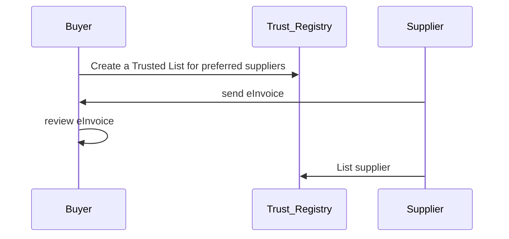
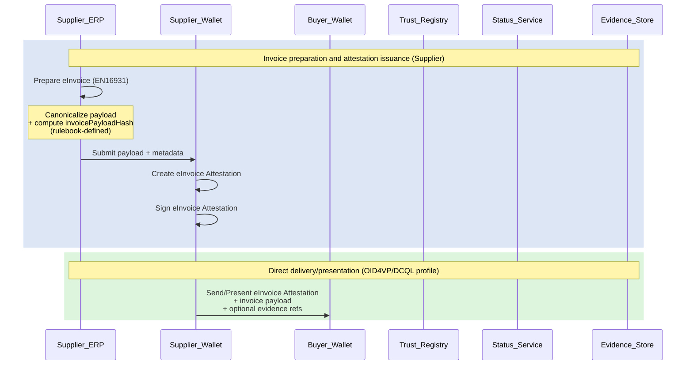
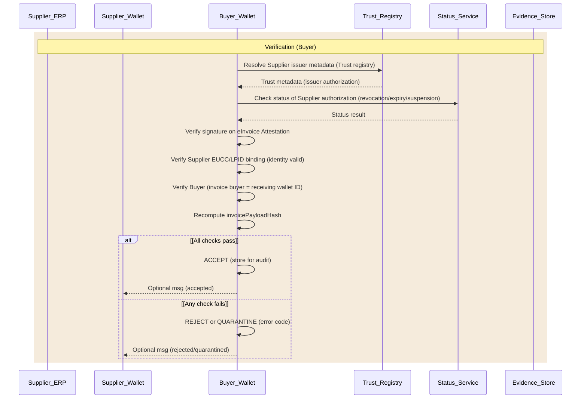
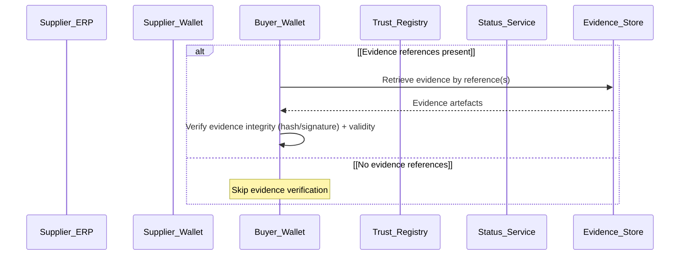
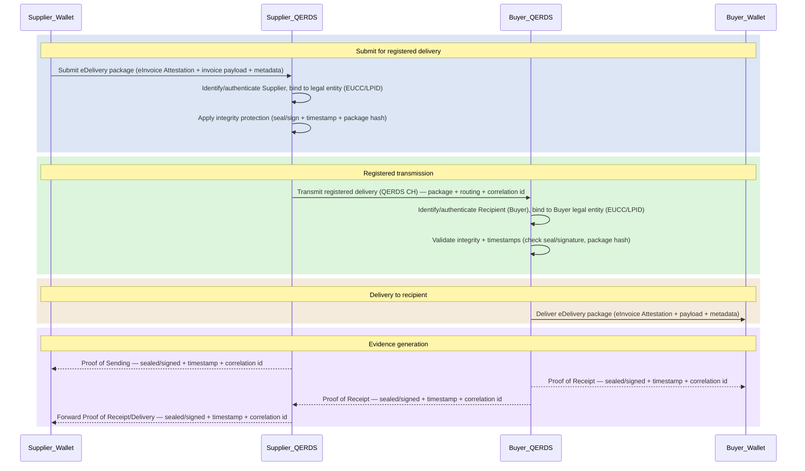

# Specification Scenario 4 — Direct eInvoicing between Business Wallets

**WE BUILD consortium | WP2 – SC5 eInvoicing**

| | |
|---|---|
| **Date** | 2026-04-29 |
| **Version** | 0.6 |
| **Status** | Draft |

---

## Index

1. [Introduction](#1-introduction)
   - 1.1 [Objectives of this document](#11-objectives-of-this-document)
   - 1.2 [Scenario introduction](#12-scenario-introduction)
2. [Scenario specification](#2-scenario-specification)
   - 2.1 [Introduction](#21-introduction)
   - 2.2 [Scenario pre-conditions](#22-scenario-pre-conditions)
   - 2.3 [Scenario main flows](#23-scenario-main-flows)
   - 2.4 [Scenario additional flows](#24-scenario-additional-flows)
   - 2.5 [Challenges and barriers](#25-challenges-and-barriers)
   - 2.6 [Working Assumptions](#26-working-assumptions)
3. [Detailed scenario flow](#3-detailed-scenario-flow)
4. [Roles and participants](#4-roles-and-participants)
   - 4.1 [Scenario roles and participants](#41-scenario-roles-and-participants)
   - 4.2 [Additional roles and partners](#42-additional-roles-and-partners)
   - 4.3 [Target country combinations](#43-target-country-combinations)
   - 4.4 [Requirements](#44-requirements)
5. [Attestations](#5-attestations)
   - 5.1 [Introduction](#51-introduction)
   - 5.2 [Attestations to be provided by other UCs/WGs/scenarios](#52-attestations-to-be-provided-by-other-ucswgsscenarios)
   - 5.3 [Created attestations in the scenario](#53-created-attestations-in-the-scenario)
- [Annex 1 – Requirements for scenario roles](#annex-1--requirements-for-scenario-roles)
- [Annex 2 – Open issues and decisions log](#annex-2--open-issues-and-decisions-log)
- [Annex 3 – Change log](#annex-3--change-log)

---

## 1. Introduction

### 1.1 Objectives of this document

This document describes Scenario 4 (Direct eInvoicing between Business Wallets) within WP2 SC5 eInvoicing in the WE BUILD consortium. It provides information on the cross-border process to be piloted, attestations to be used, and the roles and partners involved in developing and piloting the solution. It is an output of the Specification Phase and a basis for implementation and piloting.

The document is the result of the Specification Phase of the WE BUILD LSP and is a required step towards developing the solutions needed for piloting.

### 1.2 Scenario introduction

Cross-border pilot of direct eInvoice exchange where a Supplier issues an eInvoice Attestation and delivers using their business wallet directly to a Buyer business wallet, which verifies invoice integrity, supplier identity, and authorization.

The scenario is based on the following documentation:

- WE BUILD SC5 Stock Taking document (V1.0 11/12/2025).
- ARF / EUDI Wallet specifications (exact version to be confirmed by WP2/4).
- WP2 Semantics outputs for eInvoicing attestations (to be referenced when available).
- Domain standards: EN 16931 (semantic model) and Peppol BIS 3.0 (syntax binding), and ViDA-relevant guidance (where applicable).
- eInvoice Attestation specification ([v0.5 final draft](https://portal.webuildconsortium.eu/group/11/files/6915/collabora-online/edit/3850)).

---

## 2. Scenario specification

### 2.1 Introduction

The eInvoice Attestation is a verifiable representation (Reference Attestation) of an invoice exchange event, binding invoice content (via a payload hash) to a cryptographic signature associated with the Supplier's legal-person identity. It is used by a Buyer

- to verify invoice integrity,
- to verify the authenticity and validity of referenced evidence (where applicable) and,
- optionally, it may be used to approve a payment request. However, we will not pilot this in this scenario as it is part of PA4).

### 2.2 Scenario pre-conditions

Pre-conditions for piloting include:

- Buyer and Supplier each have an operational Business Wallet instance, capable of issuing, holding and verifying attestations.
- Each wallet instance SHALL be a valid We Build or European Business Wallet bound to a valid Legal Person identity credential/attestation e.g. EU Company Certificate (EUCC) or equivalent.
- Trust anchors are available for verifying legal entity identity binding and signing keys (registry/federation//EDD evidence to be defined by WP4 Trust Registry Infrastructure group).
- The Buyer has a policy decision on inbound acceptance based on a number of checks:
  - Verify signature validity on eInvoice attestation
  - Verify Supplier EUCC/LPID binding (identity valid)
  - Verify Buyer (buyer on invoice = receiving wallet EUCC/LPID)
  - Recompute and verify invoicePayloadHash
- The eInvoice attestation profile (semantics + integrity rules) is agreed and implementable by participating wallet providers.

To establish Trust we need to use either Approved Supplier attestation (as defined in scenario 1) or add suppliers to Trust Registry (LoTE/DDE). This has to be decided by the WP4 Architecture and/or Trust Registry Infrastructure working groups.

### 2.3 Scenario main flows

The diagram below shows the high-level trust setup between Buyer, Trust Registry, and Supplier:

#### eInvoice preparation and sending by Supplier

#### eInvoice verification by Buyer

#### eInvoice with evidence

### 2.4 Scenario additional flows

*(To be completed.)*

### 2.5 Challenges and barriers

**Onboarding or Discovery:** how do Supplier and Buyer find each other's Business Wallets?

Answer: The [ETSI TS 119 602](https://www.etsi.org/deliver/etsi_TS/119600_119699/119602/01.01.01_60/) specification describes the List of Trusted Entities (LoTE). It offers the necessary data and describes the mechanisms for Discovery and Verification.

For now the transport protocol will be OID4VP & DCQL. Depending on the upcoming Implementing Acts we may also need to pilot another transport protocol (QERDS?)

**Clarity of role**

- Supplier issues eInvoice attestation,
- Buyer holds eInvoice attestation,
- Buyer Business Wallet technically verifies the Invoice attestation and **Accepts** (or not)
  - Integrity
  - Trust establishment
  - Third party may verify and accept eInvoice attestation (e.g. software provider checks integrity rules)
    - eInvoice xml integrity validation
  - note: buyer is equipped to further process the einvoice information / paves way for automation
    - out of scope

### 2.6 Working Assumptions

**Transfer protocol: OID4VP/DCQL (pilot choice) in a Machine 2 Machine context**

OID4VP/DCQL is primarily about the semantics and security of verifiable presentations: what the verifier asks for (constraints), how the holder proves it (presentation), and how replay and audience binding are handled (nonce/audience/state). It does not require that the verifier (buyer) "starts the business process"; it requires that the verifier (buyer) controls the request object (or at least the parameters that make the response verifiable and non-replayable).

In our pilot, the Supplier initiates sending because it already has the Buyer's contact data (wallet address + API endpoint). That can still fit OID4VP/DCQL if we implement a short handshake where the Supplier fetches the Buyer's request object before submitting the presentation.

A workable supplier-initiated flow looks like this:

- Supplier wallet already has Buyer verifier endpoint (from contact data).
- Supplier wallet calls Buyer endpoint to obtain a fresh Presentation Request (OID4VP Request Object) that contains:
  - DCQL query constraints (what Buyer will accept),
  - nonce + audience + expiry window,
  - state/correlation identifier and the submission endpoint.
- Supplier wallet submits the invoice package as an OID4VP response (presentation) to the Buyer endpoint:
  - eInvoice Attestation,
  - invoice payload (or reference),
  - optional evidence references (or included evidence).
- Buyer verifies:
  - the presentation response integrity (signature/holder binding as defined),
  - the supplier's legal-person identity binding (EUCC/LPID or equivalent),
  - invoice payload hash binding and any evidence integrity/validity checks.

This is "Supplier-initiated delivery" operationally, while keeping "Verifier-defined requirements" cryptographically and semantically.

---

**(Q)ERDS (possible additional pilot track)**

It may be that the upcoming Implementing Acts defined by the European Commission may require to use the (Q)ERDS protocol for exchange of data.

ERDS/QERDS is about the delivery channel and the evidentiary value of sending/receiving, not about "what claims are requested" in the same way. Conceptually:

- ERDS provides registered electronic delivery evidence (proof of sending and proof of receipt/delivery) with integrity protection.
- QERDS is the qualified eIDAS variant, delivered as a qualified trust service, with stronger and more harmonised legal effects for the evidence.

In eInvoicing, we should use ERDS/QERDS when the delivery evidence itself must be strong and dispute-proof ("who sent what to whom and when"), potentially because the Commission's upcoming Business Wallet implementing decisions may require (qualified) registered delivery capabilities for certain exchanges.

**How these relate**

These are not mutually exclusive. Two common positions are:

- Choose OID4VP/DCQL when you primarily need interoperable wallet/presentation semantics (constraints, selective disclosure, consistent verification), and you can rely on ordinary HTTPS/API transport plus application logs for delivery evidence.
- Add ERDS/QERDS when you also need legally stronger delivery evidence. In that case, ERDS/QERDS can wrap the same payload (eInvoice Attestation + invoice data) as the delivery channel, while OID4VP/DCQL governs the internal presentation semantics (if you keep that inside the payload/interaction).

**Decision guidance**

Use this as a pragmatic selection table for the rulebook or pilot steering:

| Decision factor | OID4VP/DCQL | ERDS | QERDS |
|----------------|-------------|------|-------|
| Primary purpose | Interoperable presentation semantics and verifier constraints | Registered delivery evidence (non-qualified) | Highest-assurance registered delivery evidence (qualified) |
| Who initiates operationally | Buyer provides request object. Supplier initiates. | Supplier initiates; delivery service transports | Supplier initiates; qualified delivery service transports |
| What you can prove best | The buyer received a verifiable presentation that satisfies buyer-defined constraints | Sent/received with integrity and evidence of delivery | Same as ERDS, but with qualified evidentiary strength |
| Dispute profile | Normal (as is today) | Elevated risk of dispute | High-value / High-risk / Regulated |
| Dependency on buyer endpoint | Yes (needs request object and submission endpoint) | Less strict (delivery channel can queue/retry) | Less strict (delivery channel can queue/retry) |
| Operational complexity | Low | Medium | Highest (qualified trust service onboarding/ops) |
| If implementing acts push registered delivery | Might still be needed for presentation semantics, but transport may need ERDS/QERDS | Possible | Likely if "qualified" is required |

The following diagram illustrates the (Q)ERDS direct send/receive flow:

---

## 3. Detailed scenario flow

*(See section 2.3 for the main flows. Detailed step-by-step specification to be completed during the specification phase.)*

---

## 4. Roles and participants

### 4.1 Scenario roles and participants

| **Primary role** | **UC partner Name** | **Country** |
|-----------------|--------------------|----|
| Supplier | Robert Bosch | DE |
| | Sphereon | NL |
| | | |
| Buyer (Relying party) | Robert Bosch | DE |
| | | |

### 4.2 Additional roles and partners

| **Primary role** | **UC partner Name** | **Country** | **Wallet** |
|----------------|--------------------|----|--------|
| EU Business Wallet provider | Sphereon & Credenco | NL | |
| EUCC/LPID Provider | (out of scope) | | |
| Trusted list registrar | IDunion SCE | DE | |
| QEAA provider | (out of scope) | | |
| Pub-EAA provider | (out of scope) | | |
| EAA provider | Datev | DE | |
| QES provider | ValidatedID, Banqup | ES, BE | |

### 4.3 Target country combinations

| | **Issuing country** | | | | | | |
|---|---|---|---|---|---|---|---|
| **Relying Party country** | | AT | BE | DE | FI | FR | NL |
| | AT | | | | | | |
| | BE | | | | | | |
| | DE | | | | | | |
| | FI | | | | | | |
| | FR | | | | | | |
| | NL | | | | | | |

### 4.4 Requirements

The main requirements for each of the involved roles can be included as an Annex.

---

## 5. Attestations

### 5.1 Introduction

This section summarizes the attestations used to pilot the scenario. Attestations can be either created within the use case (by the scenario partners), or are to be provided by other use cases or working groups.

This section clarifies which attestations will be of what type, while the details of each attestation that will be created within the scenario itself, will be described in detail in attestation rulebooks as separate documents.

### 5.2 Attestations to be provided by other UCs/WGs/scenarios

| **Attestation name** | **Short description** | **To be provided by** | **For Countries** | **Requirements** |
|---|---|---|---|---|
| Approved Supplier | Approved Supplier attestation | SC5-WG1 | All | |

### 5.3 Created attestations in the scenario

| **Attestation name** | **Short description** | **For Countries** | **Applicable domain standards** | |
|---|---|---|---|---|
| eInvoice | Electronic Invoice Attestation | WP2 SC5 WG2 | EN16931-UBL and/or Peppol BIS3 | |
| | | | | |

---

## Annex 1 – Requirements for scenario roles

This annex lists the main functional/organizational/technical requirements for each role in the scenario.

| **Primary role** | **Specific requirement** |
|----------------|------------------------|
| User of Business Wallet | |
| | |
| | |
| Authentic sources | |
| | |
| | |
| Relying party | |
| | |
| | |
| Intermediary | |
| | |
| | |
| Business Wallet provider | |
| | |
| | |
| PID Provider | |
| | |
| | |
| Trusted list registrar | |
| | |
| | |
| QEAA provider | |
| | |
| | |
| Pub-EAA provider | |
| | |
| | |
| EAA provider | |
| | |
| | |
| QES provider | |
| | |
| | |

---

## Annex 2 – Open issues and decisions log

| # | Issue | Status | Responsible |
|---|-------|--------|-------------|
| 1 | Decide invoice payload canonicalization method(s) and hash strategy. | open | WP4 Architecture |
| 2 | Decide invoice semantic (e.g. EN16931 semantic model, Peppol BIS 3.0 UBL syntax, or both with one as primary) Or align to VIDA. | open | WP4 Semantic |
| 3 | Decide trust anchor mechanism for LPID and signing keys (LoTE/DDE registry vs federation vs QTSP signals). | open | WP4 Trust Registry |
| 4 | Decide minimum disclosed invoice elements for validation vs privacy. | open | |

---

## Annex 3 – Change log