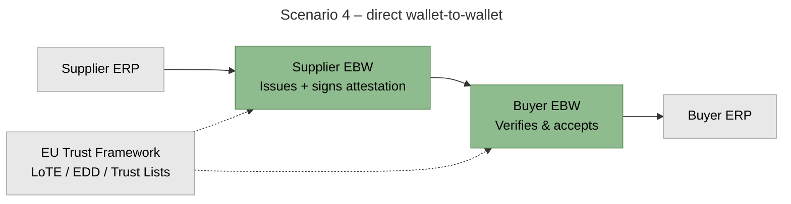
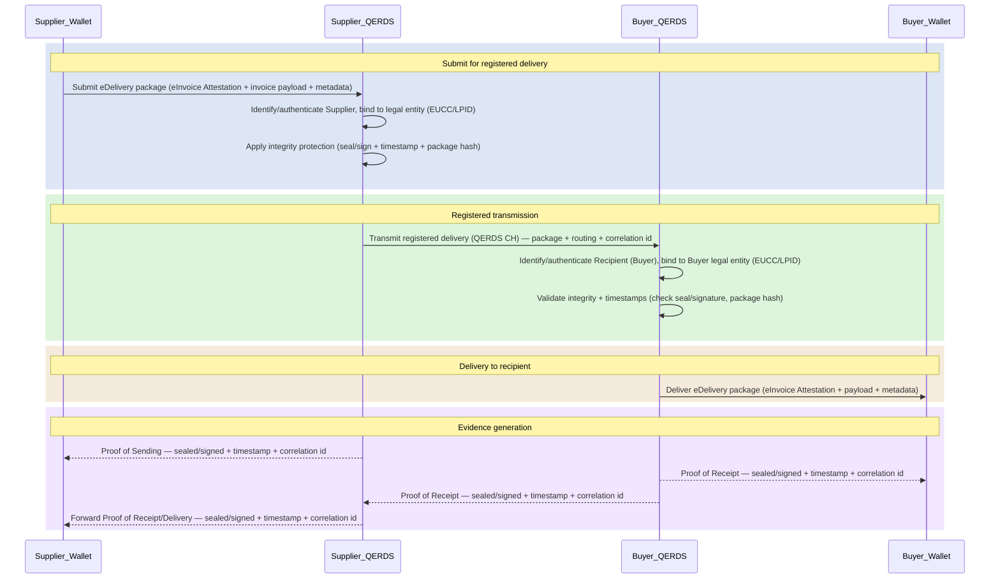

# SC5 — Scenario 4: Direct eInvoicing between Business Wallets

**WE BUILD consortium | WP2 — UC SC5**

| | |
|---|---|
| **Date** | 2026-05-24 |
| **Version** | 1.0 |
| **Status** | Final |
| **Author(s)** | Maarten Boender - Sphereon |

> **Part of the SC5 eInvoicing specification suite.** Read [Introduction.md](Introduction.md) for common concepts, roles, attestations and abbreviations.

---

## Index

1. [Introduction](#1-introduction)
2. [Pre-conditions](#2-pre-conditions)
3. [Main flow](#3-main-flow)
   - 3.1 [eInvoice preparation and sending by Supplier](#31-einvoice-preparation-and-sending-by-supplier)
   - 3.2 [eInvoice verification by Buyer](#32-einvoice-verification-by-buyer)
   - 3.3 [eInvoice with evidence](#33-einvoice-with-evidence)
4. [Detailed scenario flow](#4-detailed-scenario-flow)
5. [Additional flows](#5-additional-flows)
6. [Challenges and barriers](#6-challenges-and-barriers)
7. [Working assumptions](#7-working-assumptions)
   - 7.1 [Transfer protocol: OID4VP/DCQL](#71-transfer-protocol-oid4vpdcql)
   - 7.2 [(Q)ERDS — possible additional pilot track](#72-qerds--possible-additional-pilot-track)
- [Annex 1 — Requirements for scenario roles](#annex-1--requirements-for-scenario-roles)
- [Annex 2 — Open issues and decisions log](#annex-2--open-issues-and-decisions-log)

---

## 1. Introduction

Scenario 4 is a cross-border pilot of direct eInvoice exchange where a Supplier issues an eInvoice Attestation and delivers it using their Business Wallet directly to a Buyer Business Wallet, which verifies invoice integrity, supplier identity, and authorization.

Scenario 4 is the only scenario that works independently from the chosen transport layer as it delivers an eInvoice Attestation directly from the Supplier's Business Wallet to the Buyer's Business Wallet in a machine-to-machine context without an intermediary. Trust is not delegated to a network of access points; instead, it is established cryptographically at the point of exchange, through the Supplier's identity binding using the List of Trusted Entities (LoTE) and the integrity of the attestation itself. 

This makes Scenario 4 a pilot to test whether wallet-native, peer-to-peer eInvoice exchange, can meet the same integrity and identity assurance requirements as network-intermediated delivery, independent of a shared infrastructure operator in the middle.

```mermaid
---
title: Scenario 4 – direct wallet-to-wallet
---
flowchart LR
    A[Supplier ERP]
    B["Supplier EBW\nIssues + signs attestation"]
    C["Buyer EBW\nVerifies & accepts"]
    D[Buyer ERP]
    E["EU Trust Framework\nLoTE / EDD / Trust Lists"]

    A --> B
    B --> C
    C --> D
    E -.-> B
    E -.-> C

    classDef ebw fill:#8fbc8f,stroke:#5a8a5a,color:#000
    classDef plain fill:#e8e8e8,stroke:#aaaaaa,color:#000
    class B,C ebw
    class A,D,E plain
```

The eInvoice Attestation is a verifiable representation (Reference Attestation) of an invoice exchange event, binding invoice content (via a payload hash) to a cryptographic signature associated with the Supplier's legal-person identity. It is used by a Buyer to:

- verify invoice integrity,
- verify the authenticity and validity of referenced evidence (where applicable), and

This scenario is designated **MVP**.

### Participants

| Role | Organisation | Country |
|------|-------------|---------|
| Issuer (Supplier Wallet) | Robert Bosch | DE |
| Issuer (Supplier Wallet) | Sphereon | NL |
| Relying Party (Buyer Wallet) | Robert Bosch | DE |

The scenario is based on the following documentation:

- WE BUILD SC5 Stock Taking document (V1.0, 11/12/2025)
- ARF / EUDI Wallet specifications (exact version to be confirmed by WP2/4)
- WP2 Semantics outputs for eInvoicing attestations (to be referenced when available)
- Domain standards: EN 16931 (semantic model) and Peppol BIS 3.0 (syntax binding), and ViDA-relevant guidance (where applicable)
- eInvoice Attestation specification ([v0.5 final draft](https://portal.webuildconsortium.eu/group/11/files/6915/collabora-online/edit/3850))

---

## 2. Pre-conditions

- Buyer and Supplier each have an operational Business Wallet instance, capable of issuing, holding and verifying attestations.
- Each wallet instance SHALL be a valid We Build or European Business Wallet bound to a valid Legal Person identity credential/attestation e.g. EU Company Certificate (EUCC) or equivalent.
- Trust anchors are available for verifying legal entity identity binding and signing keys (registry/federation/EDD evidence to be defined by WP4 Trust Registry Infrastructure group).
- The Buyer has a policy decision on inbound acceptance based on a number of checks:
  - Verify signature validity on eInvoice attestation
  - Verify Supplier EUCC/LPID binding (identity valid)
  - Verify Buyer (buyer on invoice = receiving wallet EUCC/LPID)
  - Recompute and verify invoicePayloadHash
- The eInvoice attestation profile (semantics + integrity rules) is agreed and implementable by participating wallet providers.

To establish trust, either the Approved Supplier attestation (as defined in Scenario 1) must be used, or suppliers must be added to a Trust Registry (LoTE/DDE). This decision rests with the WP4 Architecture and/or Trust Registry Infrastructure working groups.

---

## 3. Main flow

The flow begins at the Supplier's ERP, which prepares the eInvoice according to the EN16931 semantic model. 
The payload is canonicalized and an invoicePayloadHash is computed following the agreed rulebook. The ERP submits the payload and associated metadata to the Supplier's European Business Wallet (EBW), which creates and cryptographically signs the eInvoice Attestation.

Before delivery, the Supplier's Wallet resolves the Buyer's Wallet address (a URL endpoint) by consulting the List of Trusted Entities (LoTE), as specified in ETSI TS 119 602. The Supplier's Wallet then presents the eInvoice Attestation directly to the Buyer's Wallet, using the OID4VP/DCQL profile in a machine-to-machine context.

Upon receipt, the Buyer's Wallet performs a sequence of verification steps: it resolves the Supplier's issuer metadata from the Trust Registry and checks the Supplier's authorization status (revocation, expiry, or suspension) against the Status Service. It then verifies the cryptographic signature on the eInvoice Attestation, confirms the Supplier's EUCC/LPID identity binding, verifies that the invoice's buyer field matches the receiving Wallet's identity. Upon reciept of the invoice it recomputes the invoicePayloadHash to confirm the integrity and autenticity of the invoice.

If evidence references are present in the attestation, the Buyer's Wallet retrieves the referenced artefacts from the Evidence Store and verifies their integrity and validity. If no evidence references are present, this step is skipped.

If all checks pass, the Buyer's Wallet ckears the invoice and stores the attestation for audit purposes. If any check fails, the invoiceattestation is rejected or quarantined with an error code. In both cases, an optional status message may be returned to the Supplier's Wallet.

---

## 4. Detailed scenario flow

## Main flow: direct eInvoice exchange between Business Wallets

### Invoice preparation (Supplier ERP)

1. The Supplier ERP prepares the eInvoice according to the EN16931 semantic model.
2. The ERP canonicalizes the invoice payload and computes the `invoicePayloadHash` following the agreed rulebook.
3. The ERP submits the invoice payload and associated metadata to the Supplier's European Business Wallet (EBW).

### Attestation issuance (Supplier Wallet)

4. The Supplier Wallet creates the eInvoice Attestation, binding the invoice payload hash to the Supplier's legal-person identity.
5. The Supplier Wallet cryptographically signs the eInvoice Attestation.

### Discovery and delivery

6. The Supplier Wallet resolves the Buyer's Wallet endpoint (URL) by consulting the List of Trusted Entities (LoTE), as specified in ETSI TS 119 602.
7. The Supplier Wallet presents the eInvoice Attestation directly to the Buyer's Wallet endpoint using the OID4VP/DCQL profile in a machine-to-machine context.

### Verification (Buyer Wallet)

8. The Buyer Wallet resolves the Supplier's issuer metadata by querying the Trust Registry.
9. The Buyer Wallet checks the Supplier's authorization status (revocation, expiry, or suspension) against the Status Service.
10. The Buyer Wallet verifies the cryptographic signature on the eInvoice Attestation.
11. The Buyer Wallet verifies the Supplier's EBWOID identity binding.
12. The Buyer Wallet verifies that the buyer field in the invoice matches the receiving Wallet's own identity.
13. The Buyer Wallet recomputes the `invoicePayloadHash` and compares it against the value in the attestation.

### Evidence verification (conditional)

14. If evidence references are present in the attestation: the Buyer Wallet retrieves the referenced artefacts from the Evidence Store and verifies their integrity (hash/signature) and validity.
15. If no evidence references are present: this step is skipped.

### Acceptance or rejection

16. If all checks pass: the Buyer Wallet **accepts** the invoice attestation and stores it for audit purposes. An optional acceptance notification may be sent to the Supplier Wallet.
17. If any check fails: the Buyer Wallet **rejects or quarantines** the invoice attestation and records an error code. An optional rejection or quarantine notification may be sent to the Supplier Wallet.

---

## 5. Additional flows

---

## 6. Challenges and barriers

**Onboarding or Discovery:** how do Supplier and Buyer find each other's Business Wallets?

Answer: The [ETSI TS 119 602](https://www.etsi.org/deliver/etsi_TS/119600_119699/119602/01.01.01_60/) specification describes the List of Trusted Entities (LoTE). The EC is proposing the European Digital Directory (EDD) for this. It offers the necessary data and describes the mechanisms for Discovery and Verification. There is an [ADR](https://github.com/webuild-consortium/wp4-architecture/pull/145) proposed for this.

For now the transport protocol will be OID4VP & DCQL. Depending on the upcoming Implementing Acts we may also need to pilot another transport protocol (QERDS?).

**Clarity of role:**

- Supplier issues eInvoice attestation
- Buyer holds eInvoice attestation
- Buyer Business Wallet technically verifies the Invoice attestation and Accepts (or not)
  - Integrity
  - Trust establishment
  - Third party may verify and accept eInvoice attestation (e.g. software provider checks integrity rules)
    - eInvoice xml integrity validation
  - Note: buyer is equipped to further process the eInvoice information / paves way for automation (out of scope)

---

## 7. Working assumptions

### 7.1 Transfer protocol: OID4VP/DCQL

**Transfer protocol: OID4VP/DCQL (pilot choice) in a Machine 2 Machine context**

OID4VP/DCQL is primarily about the semantics and security of verifiable presentations: what the Relying Party asks for (constraints), how the holder proves it (presentation), and how replay and audience binding are handled (nonce/audience/state). It does not require that the Relying Party (buyer) "starts the business process"; it requires that the Relying Party (buyer) controls the request object (or at least the parameters that make the response verifiable and non-replayable).

In our pilot, the Supplier initiates sending because it already has the Buyer's contact data (wallet address + API endpoint). That can still fit OID4VP/DCQL if we implement a short handshake where the Supplier fetches the Buyer's request object before submitting the presentation.

A workable supplier-initiated flow looks like this:

- Supplier wallet already has Buyer Relying Party endpoint (from contact data).
- Supplier wallet calls Buyer endpoint to obtain a fresh Presentation Request (OID4VP Request Object) that contains:
  - DCQL query constraints (what Buyer will accept),
  - nonce + audience + expiry window,
  - state/correlation identifier and the submission endpoint.
- Supplier wallet submits the invoice package as an OID4VP response (presentation) to the Buyer endpoint:
  - eInvoice Attestation,
  - invoice payload (or reference),
  - optional evidence references (or included evidence).
- Buyer verifies:
  - the presentation response integrity (signature/holder binding as defined),
  - the supplier's legal-person identity binding (EUCC/LPID or equivalent),
  - invoice payload hash binding and any evidence integrity/validity checks.

This is "Supplier-initiated delivery" operationally, while keeping "Relying Party-defined requirements" cryptographically and semantically.

### 7.2 (Q)ERDS — possible additional pilot track

It may be that the upcoming Implementing Acts defined by the European Commission may require use of the (Q)ERDS protocol for exchange of data.

ERDS/QERDS is about the delivery channel and the evidentiary value of sending/receiving, not about "what claims are requested" in the same way. Conceptually:

- ERDS provides registered electronic delivery evidence (proof of sending and proof of receipt/delivery) with integrity protection.
- QERDS is the qualified eIDAS variant, delivered as a qualified trust service, with stronger and more harmonised legal effects for the evidence.

In eInvoicing, we should use ERDS/QERDS when the delivery evidence itself must be strong and dispute-proof ("who sent what to whom and when"), potentially because the Commission's upcoming Business Wallet implementing decisions may require (qualified) registered delivery capabilities for certain exchanges.

These are not mutually exclusive with OID4VP/DCQL. Two common positions are:

- Choose OID4VP/DCQL when you primarily need interoperable wallet/presentation semantics (constraints, selective disclosure, consistent verification), and you can rely on ordinary HTTPS/API transport plus application logs for delivery evidence.
- Add ERDS/QERDS when you also need legally stronger delivery evidence. ERDS/QERDS can wrap the same payload (eInvoice Attestation + invoice data) as the delivery channel, while OID4VP/DCQL governs the internal presentation semantics.

**Decision guidance**

| Decision factor | OID4VP/DCQL | ERDS | QERDS |
|----------------|-------------|------|-------|
| Primary purpose | Interoperable presentation semantics and Relying Party constraints | Registered delivery evidence (non-qualified) | Highest-assurance registered delivery evidence (qualified) |
| Who initiates operationally | Buyer provides request object. Supplier initiates. | Supplier initiates; delivery service transports | Supplier initiates; qualified delivery service transports |
| What you can prove best | The buyer received a verifiable presentation that satisfies buyer-defined constraints | Sent/received with integrity and evidence of delivery | Same as ERDS, but with qualified evidentiary strength |
| Dispute profile | Normal (as is today) | Elevated risk of dispute | High-value / High-risk / Regulated |
| Dependency on buyer endpoint | Yes (needs request object and submission endpoint) | Less strict (delivery channel can queue/retry) | Less strict (delivery channel can queue/retry) |
| Operational complexity | Low | Medium | Highest (qualified trust service onboarding/ops) |
| If implementing acts push registered delivery | Might still be needed for presentation semantics, but transport may need ERDS/QERDS | Possible | Likely if "qualified" is required |

The following diagram illustrates the (Q)ERDS direct send/receive flow:

```mermaid
sequenceDiagram
    participant Supplier_Wallet as Supplier_Wallet
    participant Supplier_QERDS as Supplier_QERDS
    participant Buyer_QERDS as Buyer_QERDS
    participant Buyer_Wallet as Buyer_Wallet

    rect rgb(220, 230, 245)
        Note over Supplier_Wallet, Buyer_Wallet: Submit for registered delivery
        Supplier_Wallet ->> Supplier_QERDS: Submit eDelivery package (eInvoice Attestation + invoice payload + metadata)
        Supplier_QERDS ->> Supplier_QERDS: Identify/authenticate Supplier, bind to legal entity (EUCC/LPID)
        Supplier_QERDS ->> Supplier_QERDS: Apply integrity protection (seal/sign + timestamp + package hash)
    end

    rect rgb(220, 245, 220)
        Note over Supplier_Wallet, Buyer_Wallet: Registered transmission
        Supplier_QERDS ->> Buyer_QERDS: Transmit registered delivery (QERDS CH) — package + routing + correlation id
        Buyer_QERDS ->> Buyer_QERDS: Identify/authenticate Recipient (Buyer), bind to Buyer legal entity (EUCC/LPID)
        Buyer_QERDS ->> Buyer_QERDS: Validate integrity + timestamps (check seal/signature, package hash)
    end

    rect rgb(245, 235, 220)
        Note over Supplier_Wallet, Buyer_Wallet: Delivery to recipient
        Buyer_QERDS ->> Buyer_Wallet: Deliver eDelivery package (eInvoice Attestation + payload + metadata)
    end

    rect rgb(240, 230, 255)
        Note over Supplier_Wallet, Buyer_Wallet: Evidence generation
        Supplier_QERDS -->> Supplier_Wallet: Proof of Sending — sealed/signed + timestamp + correlation id
        Buyer_QERDS -->> Buyer_Wallet: Proof of Receipt — sealed/signed + timestamp + correlation id
        Buyer_QERDS -->> Supplier_QERDS: Proof of Receipt — sealed/signed + timestamp + correlation id
        Supplier_QERDS -->> Supplier_Wallet: Forward Proof of Receipt/Delivery — sealed/signed + timestamp + correlation id
    end
```

---

## Annex 1 — Requirements for scenario roles

> ⚠️ *To be completed during specification phase based on partner input.*

| Primary role | Specific requirement |
|-------------|---------------------|
| User of Business Wallet | |
| Authentic sources | |
| Relying party | |
| Intermediary | |
| Business Wallet provider | |
| PID Provider | |
| Trusted list registrar | |
| QEAA provider | |
| Pub-EAA provider | |
| EAA provider | |
| QES provider | |

---

## Annex 2 — Open issues and decisions log

| # | Issue | Status | Responsible |
|---|-------|--------|-------------|
| 1 | Decide invoice payload canonicalization method(s) and hash strategy. | open | WP4 Architecture |
| 2 | Decide invoice semantic (e.g. EN16931 semantic model, Peppol BIS 3.0 UBL syntax, or both with one as primary) or align to ViDA. | open | WP4 Semantic |
| 3 | Decide trust anchor mechanism for LPID and signing keys (LoTE/DDE registry vs federation vs QTSP signals). | open | WP4 Trust Registry |
| 4 | Decide minimum disclosed invoice elements for validation vs privacy. | open | |
