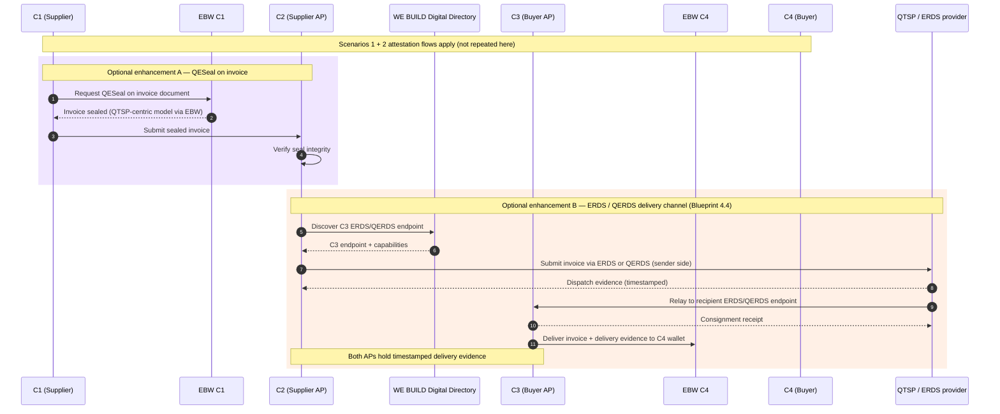

# SC5 — Scenario 5: Peppol Enhancements

**WE BUILD consortium | WP2 — UC SC5**

| | |
|---|---|
| **Date** | 2026-04-29 |
| **Version** | 0.7 |
| **Status** | Draft |
| **Author(s)** | Rune Kjørlaug - OpenPeppol |

> **Part of the SC5 eInvoicing specification suite.** Read [SC5_Introduction.md](SC5_Introduction.md) for common concepts, roles, attestations and abbreviations.

---

## Index

1. [Introduction](#1-introduction)
2. [Pre-conditions](#2-pre-conditions)
3. [Main flow](#3-main-flow)
4. [Sub-scenarios under investigation](#4-sub-scenarios-under-investigation)
5. [Proportionality: ERDS over QERDS](#5-proportionality-erds-over-qerds)
6. [Challenges and barriers](#6-challenges-and-barriers)
7. [Working assumptions](#7-working-assumptions)
- [Annex 1 — Requirements for scenario roles](#annex-1--requirements-for-scenario-roles)

---

## 1. Introduction

Scenario 5 explores additional or alternative trust-building mechanisms that can be introduced into the standard Peppol flow, beyond the attestation-based approach of Scenarios 1–3. It is research-oriented (**MVP+**) and evaluates whether these mechanisms provide proportionate value relative to their complexity and cost.

A natural structural alignment exists between the Peppol 4-corner model and the QERDS delivery architecture defined in the WE BUILD Blueprint (section 4.4): sender QTSP (A) ↔ C2, recipient QTSP (B) ↔ C3, with the WE BUILD Digital Directory for endpoint discovery. Scenario 5 explores whether this pattern adds meaningful non-repudiation and legal certainty beyond what the existing Peppol PKI and AS4 transport already provide, and evaluates the proportionality of the Qualified (Q) level relative to the ERDS (non-qualified) alternative.

---

## 2. Pre-conditions

In addition to the common pre-conditions (SC5_Introduction.md, section 2.3):

1. At least one of Scenarios 1 or 2 is operational in the pilot.
2. A QTSP capable of providing QESeal and/or QERDS/ERDS services is available to at least one AP in the pilot.
3. The added mechanisms are not disruptive to the core Peppol flow.

---

## 3. Main flow

The following illustrates how the QERDS four-corner delivery model (Blueprint section 4.4) maps onto the Peppol 4-corner model, and how QESeal can be applied at the C1 level. The exact combination to be piloted is TBD.

---

## 4. Sub-scenarios under investigation

| Enhancement | Description | Value | Complexity |
|------------|-------------|-------|------------|
| QESeal on invoice | C1 applies a qualified seal to the BIS invoice document before handing to C2 | Non-repudiation and integrity proof at document level | Medium — requires QTSP integration at C1 |
| ERDS delivery evidence | C2-to-C3 exchange routed via a non-qualified registered delivery service | Timestamped delivery proof; proportionate baseline — see section 5 | Medium |
| QERDS delivery evidence | As above using a Qualified Registered Delivery Service | Higher assurance delivery proof; included for comparison | High — requires both APs connected to QERDS |
| EBW data portability | Invoice or attestation data exported via EBW data portability mechanisms | Portability, audit trail, archiving | Low — leverages existing wallet capabilities |

---

## 5. Proportionality: ERDS over QERDS

Scenario 5 takes the position that **ERDS is the proportionate delivery layer for Peppol eInvoicing**, and that the Qualified (Q) level of QERDS is not necessary. The Q compensates for the absence of payload-level trust: when the transport channel is the only source of trust it must be qualified. When trust is already established in the data through attestations (Scenarios 1 and 2) and in the sender identity through the Peppol PKI, the channel needs only to be reliable — not qualified.

> **Principle (Blueprint §6 and SC5 Attestations presentation):** Regulatory effectiveness is maximised when control is placed in trust frameworks rather than embedded in interoperability layers. QERDS places trust in the transport layer — disproportionate when the data and the sender are already trusted through other means.

QERDS is included as a comparison point in the pilot. The expected finding is that ERDS delivers sufficient non-repudiation at materially lower cost and operational complexity for APs and SMEs.

---

## 6. Challenges and barriers

- **QTSP availability and cost**: qualified services require QTSP agreements and add operational overhead; this may be a barrier for smaller APs and SMEs.
- **Peppol AS4 profile compatibility**: ERDS/QERDS integration must not break AS4 conformance; the precise integration point (alongside or replacing AS4) needs definition.
- **Incremental value over existing infrastructure**: the incremental value of Scenario 5 must be clearly articulated relative to what the existing Peppol PKI and AS4 transport acknowledgements already provide.
- **Digital Directory readiness**: the WE BUILD Digital Directory (simulating the future EU Digital Directory) must be available for endpoint discovery.

---

## 7. Working assumptions

| # | Assumption | Rationale |
|---|-----------|-----------|
| WA5.1 | Scenario 5 is piloted by at most one pair of APs in a single country combination. | The complexity of each enhancement merits focused exploration before broader rollout. |
| WA5.2 | ERDS is the primary target for sub-scenario B; QERDS is included for comparison only if a QTSP partner is available. | The proportionality argument in section 5 favours ERDS; the pilot should validate this in practice. |
| WA5.3 | Results of Scenario 5 are primarily research and policy outputs. Go/no-go for production standardisation is deferred to post-pilot evaluation. | The value proposition must be validated before standardisation; findings should feed into OpenPeppol's positioning on registered delivery for eInvoicing. |

---

## Annex 1 — Requirements for scenario roles

> ⚠️ *To be completed during specification phase based on partner input.*

| Primary role | Specific requirement |
|-------------|---------------------|
| 1. Supplier (C1) | a. Must have an operational European Business Wallet |
| | b. Must be a registered Peppol participant |
| | c. Optionally: must be able to request QESeal via EBW |
| 2. Buyer (C4) | a. Must have an operational European Business Wallet |
| | b. Must be a registered Peppol participant |
| 3. Supplier's AP (C2) | a. Must be a certified Peppol Access Point |
| | b. Must support attestation flows from Scenarios 1 and/or 2 |
| | c. Optionally: must be able to connect to an ERDS/QERDS provider |
| 4. Buyer's AP (C3) | a. Must be a certified Peppol Access Point |
| | b. Must support attestation flows from Scenarios 1 and/or 2 |
| | c. Optionally: must be able to receive via an ERDS/QERDS endpoint |
| 5. QTSP / ERDS provider | a. Must provide certified ERDS (or QERDS if available) services |
| | b. Must support timestamped dispatch and consignment evidence |
| 6. WE BUILD Digital Directory | a. Must be operational and expose AP ERDS/QERDS endpoint data |
| 7. EBW provider | a. Must support OpenID4VCI issuance per WBCS cs-01 |
| | b. Must support OpenID4VP presentation per WBCS cs-02 |
| | c. Must pass ITB conformance testing before participating in pilots |
