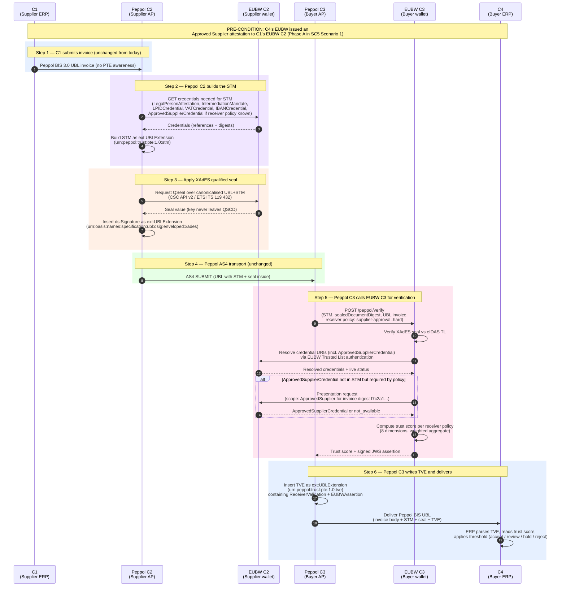
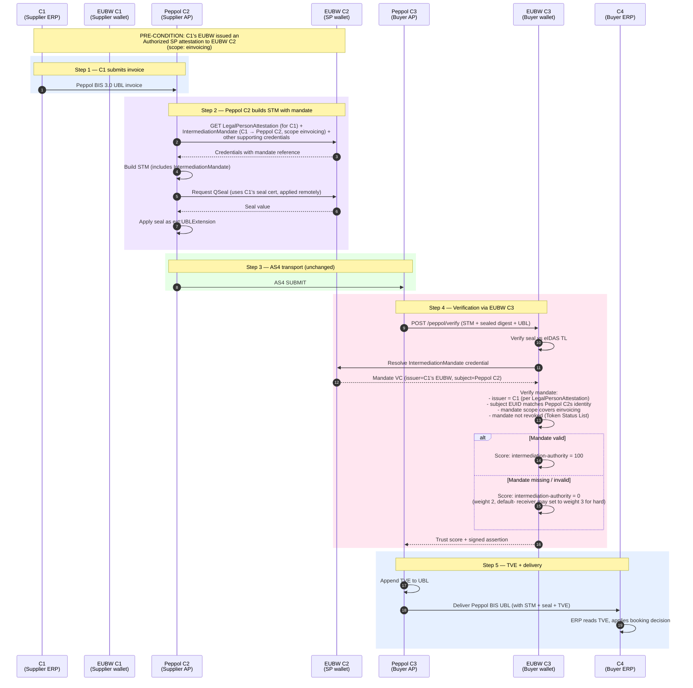
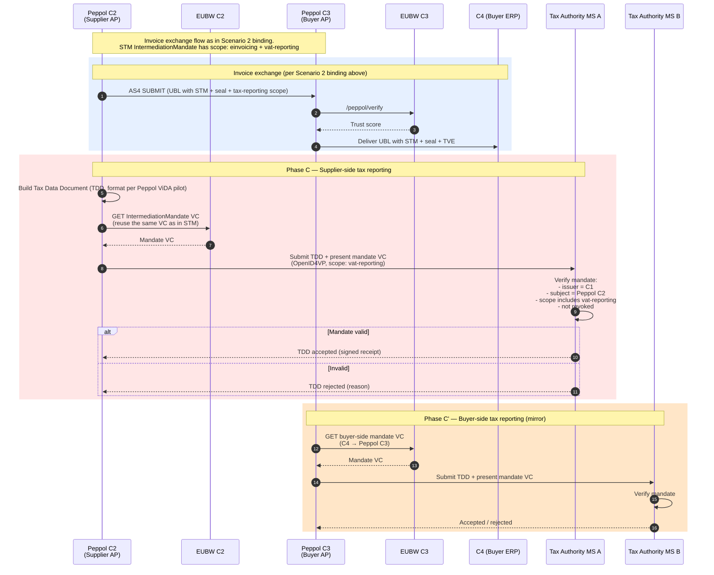

# SC5 Technical Binding: PTE Encoding of SC5 Attestations

**WE BUILD consortium | WP2 — UC SC5 | Technical Binding Note**

| | |
|---|---|
| **Date** | 2026-06-01 |
| **Version** | 0.1 Draft |
| **Status** | For discussion |
| **Author(s)** | Hans Boone — Banqup |
| **Reviewers (proposed)** | Rune Kjørlaug (OpenPeppol), SC5 partners |

> **Companion to the SC5 specification suite.** Read [Introduction.md](../../Scenario/Description.md), [Scenario 1](../../Scenario/Scenario1.md), [Scenario 2](../../Scenario/Scenario2.md), [Scenario 3](../../Scenario/Scenario3.md) for the SC5 business specification this document binds to.

> **Companion TrustLayer documents:** [PTE Architecture](../architecture/PTE-Architecture.md) (Layer 1 — the envelope), [APEIP Specification](../protocol/APEIP-Specification.md) (Layer 2 — the AP↔EUBW protocol), [Peppol binding](../bindings/peppol/Oxalis-NG-Handler.md) (Layer 3 — the transport binding used for SC5).

> **Note on transport-independence.** The Portable Trust Envelope is transport-independent (see [TrustLayer README](../README.md) for the three-layer model). SC5 scenarios 1, 2, 3, and 5 use Peppol as their transport, so this document uses the **Peppol binding** of the PTE throughout. The same SC5 attestations (Approved Supplier, Authorized Service Provider) could in principle be carried via the [mail binding](../bindings/mail/Mail-Binding.md) or [QERDS binding](../bindings/qerds/QERDS-Binding.md) for use cases outside Peppol — the trust artifacts are identical; only the carrier element changes.

---

## Index

1. [Purpose and scope](#1-purpose-and-scope)
2. [What this document is NOT](#2-what-this-document-is-not)
3. [The deferred technical questions in SC5](#3-the-deferred-technical-questions-in-sc5)
4. [PTE overview — minimal recap](#4-pte-overview--minimal-recap)
5. [Mapping SC5 attestations to PTE elements](#5-mapping-sc5-attestations-to-pte-elements)
6. [Detailed sequence — Scenario 1 with PTE binding](#6-detailed-sequence--scenario-1-with-pte-binding)
7. [Detailed sequence — Scenario 2 with PTE binding](#7-detailed-sequence--scenario-2-with-pte-binding)
8. [Detailed sequence — Scenario 3 with PTE binding](#8-detailed-sequence--scenario-3-with-pte-binding)
9. [What PTE adds beyond SC5](#9-what-pte-adds-beyond-sc5)
10. [Open questions for SC5 reviewers](#10-open-questions-for-sc5-reviewers)
11. [Pilot proposal](#11-pilot-proposal)

---

## 1. Purpose and scope

The SC5 specification suite (v1.0 Final, 2026-05-24) defines three attestation types, the actors that issue and consume them, and the business flows in which they are used. It explicitly defers several technical encoding choices to later phases:

- *Scenario 1, step B.3a*: "C2 may attach attestation metadata to the AS4 message (optional, **to be specified**)."
- *Scenario 1, step B.1*: "C1 may present the attestation out-of-band (API call separate from invoice submission); **scope to be defined**."
- *Scenario 2, Challenges*: "defining where exactly attestation presentation fits into the AS4 message exchange is a **key technical design question requiring alignment with the Peppol AS4 profile owners**."
- *Scenario 2, WA2.2*: a placeholder ("pre-transmission handshake, not embedded in the AS4 message itself") flagged as the minimum-viable working assumption.

This document proposes the **Peppol Trust Envelope (PTE)** as the technical encoding that closes these deferrals. The PTE is a UBL extension schema that carries SC5 attestations inside the Peppol BIS Billing 3.0 invoice itself, with a qualified electronic seal binding the attestations to the invoice content, and a post-receipt validation envelope that reaches C4's ERP.

**Relationship to SC5:** the PTE is **additive** and **complementary**. It does not change SC5's attestation schemas, actor model, business flows, or wallet protocols. It specifies *how* the attestations are encoded on the Peppol wire and *where* the verification result is recorded so it reaches C4.

| SC5 defines | PTE specifies |
|---|---|
| What attestations exist (schemas, attributes, validity) | How they ride inside the Peppol BIS UBL document |
| Who issues, holds, presents, verifies | Where the verification result lives so C4 can read it |
| Wallet-to-wallet protocols (OpenID4VCI, OpenID4VP) | The integration boundary between Peppol APs and EUBWs |
| Binary attestation verification (valid / invalid) | Optional dimensional trust score with policy-driven decisions |

---

## 2. What this document is NOT

- **Not a rewrite of SC5.** SC5 v1.0 is the authoritative business specification. This document does not propose changes to it.
- **Not a replacement for the SC5 attestation rulebooks.** The Approved Supplier and Authorized Service Provider attestation schemas remain as specified in `Attestations/ApprovedSupplier.md` and `Attestations/AuthorizedServiceProvider.md`.
- **Not a Peppol governance proposal.** OpenPeppol Coordination Committee approval would be sought separately, after pilot validation.
- **Not in scope for Scenario 4.** Scenario 4 uses OID4VP/DCQL and the eInvoice Attestation; it does not involve the Peppol AS4 transport that the PTE extends.

---

## 3. The deferred technical questions in SC5

SC5 leaves four technical questions open. The PTE answers each:

| # | SC5 deferred question | PTE answer |
|---|---|---|
| Q1 | Where in the AS4 exchange does the attestation presentation happen? | Attestations are carried **inside the UBL document** as `<ext:UBLExtension>` elements (the STM), not as a separate AS4 handshake. The AS4 transport layer is unchanged. |
| Q2 | How are attestations bound to the invoice content cryptographically? | A **XAdES qualified electronic seal** (UBL DSig profile, eIDAS Article 35) covers the invoice body and the STM together. Tampering with either invalidates the seal. |
| Q3 | How does C4 (the buyer's ERP) see the verification result? | A second UBL extension, the **Trust Validation Envelope (TVE)**, is appended by C3 after verification. C4's ERP parses it for the trust signals. |
| Q4 | How does the receiver fetch a credential the sender didn't include? | The **EUBW C3 → EUBW C2 presentation request** uses the standard wallet-to-wallet protocol over the EUBW Trusted List, no Peppol governance change required. |

---

## 4. PTE overview — minimal recap

The PTE introduces two UBL extensions, both inside the existing Peppol BIS Billing 3.0 invoice:

```
<Invoice>
  <ext:UBLExtensions>
    <ext:UBLExtension URI="urn:peppol:trust:pte:1.0:stm">     ← STM: attestations, written by Peppol C2 before sealing
    <ext:UBLExtension URI="urn:oasis:names:specification:ubl:dsig:enveloped:xades">  ← XAdES seal, covers invoice + STM
    <ext:UBLExtension URI="urn:peppol:trust:pte:1.0:tve">     ← TVE: validation result, appended by Peppol C3 after verification
  </ext:UBLExtensions>
  ← Peppol BIS 3.0 invoice body (unchanged)
</Invoice>
```

Three architectural properties:

1. **C1 and C4 keep existing integrations.** C1's ERP sends a normal Peppol BIS UBL; C4's ERP receives a Peppol BIS UBL with two additional `<ext:UBLExtension>` elements to parse. No new protocols, no new wallet calls.
2. **EUBW integration happens at the Peppol provider layer.** Peppol C2 ↔ EUBW C2, Peppol C3 ↔ EUBW C3. The four corners' ERPs are insulated.
3. **The qualified seal closes the binding loop.** SC5 attestations gain content-integrity binding via the same seal that protects the invoice — they cannot be separated, swapped, or re-pointed at a different invoice.

Full PTE specification: see [../architecture/PTE-Architecture.md](../architecture/PTE-Architecture.md).

---

## 5. Mapping SC5 attestations to PTE elements

The three SC5 attestation types map cleanly onto STM elements:

| SC5 attestation | PTE element | Path inside STM | Notes |
|---|---|---|---|
| **Approved Supplier** (Scenario 1, 4, 5) | `ApprovedSupplierCredential` | `STM/SupportingCredentials/ApprovedSupplierCredential` | Cardinality 0..1. Pushed by Peppol C2 at send if known; pulled by EUBW C3 from EUBW C2 if required by receiver policy and missing. |
| **Authorized Service Provider** (Scenario 2, sender side, C1→C2, scope `einvoicing`) | `IntermediationMandate` | `STM/IntermediationMandate` | Cardinality 0..1. `mandate_scope.scope_type = einvoicing` maps to PTE `scope = e-invoicing:seal+submit`. |
| **Authorized Service Provider** (Scenario 3, sender side, with `vida:tax_report` scope) | `IntermediationMandate` with extended scope | `STM/IntermediationMandate` | Same element, `scope` extended to `e-invoicing:seal+submit;vat-reporting`. Tax Authority verifies the same way EUBW C3 does. |
| **eInvoice Attestation** (Scenario 4) | (Out of scope for PTE) | — | Scenario 4 does not use Peppol AS4 transport; the PTE does not apply. |

**Field-level mapping for `ApprovedSupplierCredential`** (SC5 attestation attributes → STM/W3C VC):

| SC5 attribute | W3C VC claim | Carried in STM as |
|---|---|---|
| `relationship_id` | `credentialSubject.relationshipId` | Inside `CredentialValue` (JWT-secured VC or SD-JWT VC) |
| `relationship_type` | `credentialSubject.relationshipType` | Inside `CredentialValue` |
| `relationship_status` | `credentialSubject.relationshipStatus` | Inside `CredentialValue` |
| `relationship_start_date` | `validFrom` | VC envelope |
| `relationship_end_date` | `validUntil` | VC envelope |
| `authoritative_source` | `credentialSubject.authoritativeSource` | Inside `CredentialValue` |
| (issuer = C4's EBW, implicit from wallet) | `issuer` | VC envelope; resolved against EUBW Trusted List |
| (subject = C1's wallet, implicit) | `credentialSubject.id` | VC envelope; bound to participant ID via `BindingMetadata` |

**Field-level mapping for `AuthorizedServiceProvider` attestation** (sender side):

| SC5 attribute | W3C VC claim | Carried in STM as |
|---|---|---|
| `mandate_id` | `credentialSubject.mandateId` | Inside `CredentialValue` |
| `mandate_type` | `credentialSubject.mandateType` | Inside `CredentialValue` |
| `mandate_start_date` | `validFrom` | VC envelope |
| `mandate_end_date` | `validUntil` | VC envelope |
| `mandating_business.vat_number` | `credentialSubject.mandator.vatNumber` | Inside `CredentialValue` |
| `mandating_business.country_code` | `credentialSubject.mandator.countryCode` | Inside `CredentialValue` |
| `mandate_scope.scope_type` | `credentialSubject.scope` | Inside `CredentialValue`; `STM/IntermediationMandate/BindingMetadata/Scope` mirrors for fast policy filtering |
| `mandate_scope.vat_reporting_scope` (Scenario 3) | `credentialSubject.scope` includes `vat-reporting` token | Inside `CredentialValue` |
| `authority_source` | `credentialSubject.authoritySource` | Inside `CredentialValue` |

The mapping preserves SC5's data model end-to-end. The STM is the **wire format**; the SC5 attestation rulebooks remain the **content schema** of what travels inside `CredentialValue`.

---

## 6. Detailed sequence — Scenario 1 with PTE binding

The PTE binding of Scenario 1 (Supplier pre-approval) shows where the attestation rides on the wire and how the verification result reaches C4.



**What's new vs SC5 Scenario 1 as currently written:**

- The Approved Supplier attestation rides **inside the UBL invoice** (STM), not as a separate OpenID4VP handshake. This collapses the "pre-transmission handshake" of WA2.2 into a single AS4 send.
- The attestation is **cryptographically bound to the invoice content** via the XAdES seal. Today's SC5 has no content-level seal.
- **C4 sees the verification result.** SC5 Scenario 1 stops verification at C2; the PTE binding extends visibility to C4 via the TVE.
- The **policy-driven decision** (accept / review / hold / reject) is explicit, not implicit. SC5's binary verify-or-reject is preserved as the default case (hard requirement on `supplier-approval`); soft policies become an additional option.

**What's preserved from SC5 Scenario 1 unchanged:**

- The Approved Supplier attestation schema (`Attestations/ApprovedSupplier.md`).
- The issuance phase (Phase A) using OpenID4VCI from EUBW C4 to EUBW C1.
- C2 as the (now indirect, via EUBW C2 and EUBW C3) verifier.
- Revocation via IETF Token Status List.
- WBCS cs-01 / cs-02 conformance.

---

## 7. Detailed sequence — Scenario 2 with PTE binding

Scenario 2 (Authorized Service Provider attestation) maps directly onto the STM's `IntermediationMandate` element.



**Key resolution of SC5 Scenario 2's open questions:**

- **"Where exactly attestation presentation fits into AS4"** (SC5 Challenge): the attestation is in the UBL `<ext:UBLExtensions>` *inside* the AS4 payload, not adjacent to or before the AS4 exchange. There is no separate handshake. The Peppol AS4 profile is unchanged.
- **WA2.2 "pre-transmission handshake"** is no longer the working assumption. The PTE makes the attestation part of the document itself.
- **"C2 may attach attestation metadata to the AS4 message"** (Scenario 1, B.3a): the STM IS that metadata, with a specific schema.

**Note on C4 → C3 authorization:** SC5 Scenario 2 also considers the buyer-side mandate (C4 issues an Authorized SP attestation to C3, MVP+). Trust between Peppol C3 and EUBW C3 is established at provider-onboarding time via service credentials, mTLS, or an inter-provider `IntermediationCredential`. A per-invoice verification of this trust would be theatre, not security — it does not add cryptographic protection beyond what the onboarding already established. The PTE binding therefore does not include a separate `ReceiverIntermediationMandate` element. The sender-side mandate (C1 → Peppol C2) is the meaningful artifact because it travels cross-organization with the invoice.

---

## 8. Detailed sequence — Scenario 3 with PTE binding

Scenario 3 extends the Authorized SP attestation with a `vida:tax_report` scope and adds Tax Authority verification. The PTE binding inherits Scenario 2's flow for invoice exchange and adds the tax-reporting branch.



**Reuse efficiency:** the same `IntermediationMandate` VC that was carried in the STM (Scenario 2 binding) is presented to the Tax Authority in Phase C. No new attestation is issued — only the `scope` field is broader (`einvoicing` + `vat-reporting`). This matches SC5 WA3.1.

**TDD format:** out of scope for this binding document. As per SC5 WA3.2, the TDD format is consumed from the Peppol ViDA pilot. The PTE does not specify it. The PTE only specifies how the mandate VC reaches the Tax Authority — which mirrors how it reaches EUBW C3 in the invoice flow (OpenID4VP presentation).

---

## 9. What PTE adds beyond SC5

Five capabilities the PTE adds that are not in SC5 today, and that may inform future SC5 revisions:

| Capability | Why it matters | SC5 status today |
|---|---|---|
| **Qualified electronic seal on invoice payload** | Closes the content-binding gap: SC5 attestations alone don't protect the invoice content. Without a content seal, a malicious C2 could pair a valid attestation with a tampered invoice. | Not specified |
| **C4 visibility of trust verification result** | SC5 stops verification at C2 (Scenario 1) or C3 (Scenario 2/3). C4's ERP never sees the trust signal. The TVE extension brings it to C4. | Not specified |
| **Trust score with dimensional decomposition** | Binary verify/reject loses information (e.g. "credential valid but content mismatch" vs "credential revoked"). Dimensional scoring lets receivers apply policy. | Not specified |
| **Pull-at-receive credential presentation** | If a receiver requires the Approved Supplier credential and the sender didn't include it (different Peppol provider, dynamic buyer policy), EUBW C3 can pull it from EUBW C2 at verification time. | Not specified (SC5 Scenario 1 assumes push only) |
| **Live revocation against sender's wallet** | The Token Status List can be checked at verification time, not just at send time. A credential revoked between send and receive surfaces correctly. | Implied by Token Status List ADR but not detailed in scenario flows |

These are presented as **opportunities for SC5**, not corrections. Each could be incorporated into a future SC5 revision or remain as a Banqup-led technical extension under the PTE namespace.

---

## 10. Open questions for SC5 reviewers

1. **Acceptance of the PTE as the technical binding.** Is the SC5 working group open to adopting the PTE as the in-document encoding of SC5 attestations, or does SC5 prefer to remain encoding-agnostic and let each implementation choose?
2. **Position relative to WA2.2.** If the PTE is adopted, WA2.2 ("pre-transmission handshake") would be superseded by "STM inside the UBL document." Acceptable?
3. **Scope of the qualified seal.** SC5 currently has no QSeal on the invoice payload. Adding one is a substantive change to the SC5 flow (introduces QTSP involvement on the send side). Is this in scope for the pilot, or out of scope for now?
4. **TVE visibility to C4.** Does the SC5 working group agree that the trust verification result should reach C4's ERP, or is C2/C3-internal visibility sufficient for the MVP?
5. **Pilot scope alignment.** Pilot 1 (Banqup as C2 + EUBW C2 on the sender side, Semansys C3 + Sphereon EUBW C3 on the receiver side) is the natural first pilot for the PTE binding. Acceptable?
6. **Standardization track.** OpenPeppol publication as a Peppol BIS extension (faster, Peppol-only) versus CEN/TC 434 EN 16931 Extension under TR 16931-5 (broader, slower, covers CII as well). One, the other, or both?

---

## 11. Pilot proposal

A minimal pilot of the PTE binding can be run inside SC5 Pilot 1 (Scenarios 1 + 2) without requiring changes to other partners' integrations:

| Pilot stage | Actor | Action |
|---|---|---|
| Stage 0 | All | Confirm acceptance of PTE binding for the pilot (this document signed off). |
| Stage 1 | Banqup (C2 + EUBW C2) | Implement STM construction and XAdES sealing using existing Banqup QTSP infrastructure. Same-provider auth mode (§4.9.6 of PTE design). |
| Stage 2 | Semansys (Peppol C3) + Sphereon (EUBW C3) | Implement /peppol/verify endpoint at Sphereon, integration call from Semansys. |
| Stage 3 | All | End-to-end test of Pilot 1 flow (NL → FR) with STM + seal + TVE in the Peppol BIS UBL. |
| Stage 4 | Banqup | Implement push-at-send for Approved Supplier credential when receiver policy known via SMP. |
| Stage 5 | Sphereon | Implement pull-at-receive (EUBW C3 → EUBW C2 presentation request) for missing Approved Supplier credential. |
| Stage 6 | All | Demonstrate end-to-end Scenario 1 + Scenario 2 with full PTE binding. |

The pilot does **not** require:

- Changes to C1's ERP (Green Flowers) — sends normal Peppol BIS UBL.
- Changes to C4's ERP (Les Roses D'or) — receives normal Peppol BIS UBL with two extra UBL extensions to optionally parse.
- Changes to the Peppol AS4 profile, SMP, SML, or transport PKI.
- Approval from OpenPeppol Coordination Committee (the STM and TVE live in `<ext:UBLExtensions>`, which UBL explicitly reserves for "foreign content not defined by the business vocabulary").

Post-pilot artifacts:

- The STM and TVE XML schemas (XSD).
- Peppol BIS Billing 3.0 schematron rules for STM and TVE validation.
- A reference implementation contribution (open source, Banqup-led).
- A draft contribution to OpenPeppol for formal Peppol BIS extension recognition.
- A separate draft contribution to CEN/TC 434 under TR 16931-5 for the cross-CIUS variant.

---

**End of document.**
